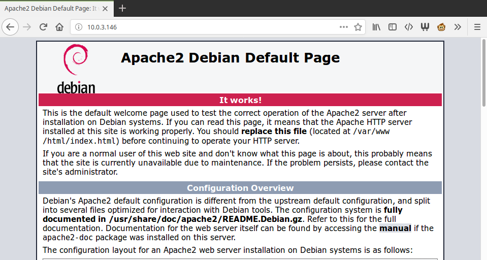
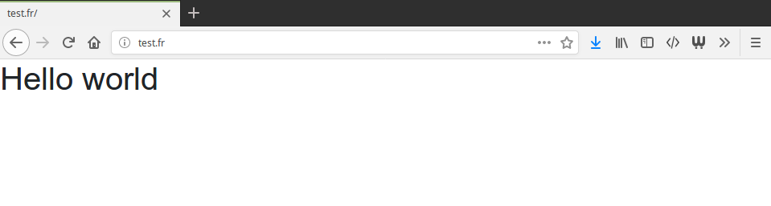

---

title: Installer Apache dans un container LXC
description: Participez au développement de votre navigateur preéferé
date: 2017-11-16 08:00:00 +0200
tags: [apache, linux, lxc]
categories: tutorial
image: ./images/lxc_container.png
comments: true
lang: fr
---

Apache est un serveur HTTP distribué sous licence libre. Avec quasiment [50% de part de marché](https://www.developpez.com/actu/129511/Serveurs-Web-Nginx-detient-desormais-un-tiers-des-parts-de-marche-tandis-qu-Apache-chute-en-dessous-des-50-pourcent-d-apres-W3Tech/) c'est un des serveur web les plus populaire.

Ses avantages sont:

- **communauté** imposantes et donc beaucoup de ressources disponibles
- **modules** qui permettent de prendre en charge de nombreux langages (PHP, Python, Ruby, etc..) et de personnaliser [Apache][apache]
- **open-source** et maintenu par la [fondation Apache](https://fr.wikipedia.org/wiki/Fondation_Apache)
- **disponible** sur toutes les plateformes

Beaucoup de tutoriels existent pour installer [Apache][apache] mais voici les informations que j'aurais aimé avoir sous la mains à mes débuts.

## Créer un container

Vous pouvez très bien faire vos tests directement sur votre serveur ou sur votre environnement de développement mais il est intéressant de créer un **container** isolé de votre système. L'avantage est que si l'on casse le système, on peut le reproduire très facilement.

Pour cela, on utilise [LXC][lxc] _(**L**inu**x** **C**ontainer)_. [LXC][lxc] s'installe très facilement avec un petit `apt install`

```bash
apt install lxc lxc-templates debootstrap
```

Ensuite, on crée un container basé sur une image Debian vierge grâce à `lxc-create`:

```bash
sudo lxc-create --name apache -t debian
```

On démarre le container avec `lxc-start` et on se connecte dessus à l'aide de `lxc-attach`:

```bash
sudo lxc-start  --name apache
sudo lxc-attach --name apache
```

Nous voilà dans notre container isolé de notre système.

## Installation d'apache

Rien de bien sorcier, un petit `apt install` et c'est plié:

```bash
apt install apache2
```

Afin de connaître l'adresse IP de notre machine on lance un `ìfconfig`. On ouvre donc notre navigateur et on tape directement [http://10.0.3.416](http://10.0.3.416) (en remplaçant par votre IP). La page d'accueil par défaut apparaît!



Ce n'est pas de la magie, la page par défaut est située ici.

```plain
/var/www/
└── html
    └── index.html
```

## Création de notre projet

Nous savons donc que nos projets doivent être stockées dans dans **/var/www**. Nous allons créer notre projet _test.fr_ directement dans ce dans ce dossier.

```bash
mkdir -p /var/www/test.fr/public
```

> Nous créeons un dossier _public_ pour séparer ce qui sera accessible de ce qui sera innaccessible à tout le monde. C'est une bonne pratique

Maintenant on crée le fichier _index.html_.

```bash
echo '<h1>Hello world</h1>' > /var/www/test.fr/public/index.html
```

Et afin d'avoir du CSS, on rajoute la dernière version de [Twitter Bootstrap](http://getbootstrap.com) en utilisant `curl`.

```bash
apt install curl
curl https://maxcdn.bootstrapcdn.com/bootstrap/4.0.0-beta.2/css/bootstrap.css > /var/www/test.fr/public/twitter-bootstrap.css
echo '<link rel="stylesheet" href="twitter-bootstrap.css">' >> /var/www/test.fr/public/index.html
```

Si tout c'est bien déroulé (il n'y a pas de raison), vous devriez avoir ça:

```plain
/var/www/test.fr/
└── public
    ├── index.html
    └── twitter-bootstrap.css
```

## Le Virtual Host

Le **Virtual Host** (**Vhost** pour les intimes) nous permet d' **héberger plusieurs sites** sur un même serveur. Nous allons donc installer notre site _test.fr_ sans écraser le site par défaut.

Pour cela, il suffit de créer une nouvelle configuration dans le dossier _/etc/apache2_. Deux dossiers existent pour stocker les configurations:

- _sites-availables_ contient les configurations des sites disponibles
- _sites-enabled_ contient les configurations des sites activées

Pour le moment, nous ajoutons notre configuration dans _sites-availables_:

```bash
vi /etc/apache2/sites-availables/test.fr.conf
```

.. et on rentre la configuration minimale:

```apache
# on spécifie le port d'écoute de ce site (80 = HTTP)
<VirtualHost *:80>
  # le nom de domaine qui sera utilisé pour ce site
  ServerName test.fr
  # le dossier racine de notre site
  DocumentRoot /var/www/test.fr/public
</VirtualHost>
```

> Eh mais Je ne possède pas [test.fr](http://test.fr/), comment va t-on faire?

C'est vrai mais on peut le simuler très facilement. Sur le PC client (celui qui visite le site), on va ajouter une **entrée DNS** au fichier _/etc/hosts_. Une entrée DNS fait correspondre un **nom de domaine** (= _test.fr_) à une **adresse IP** (= 10.0.3.416).

```bash
echo '10.0.3.146 test.fr' | sudo tee --append /etc/hosts
```

On termine par activer notre configuration. On utilise `a2ensite` qui va s'occuper de créer un **lien symbolique** de notre fichier de configuration dans le dossier _sites-enabled_.

```bash
a2ensite test.fr
```

Il suffit de redémarrer notre serveur Apache.

```bash
systemctl reload apache2
```

Et de se rendre sur [http://test.fr](http://test.fr).



Dans un prochain article on verra comment améliorer la configuration de base d'[Apache][apache]

[lxc]: https://linuxcontainers.org/fr/
[apache]: https://fr.wikipedia.org/wiki/Apache_HTTP_Server
