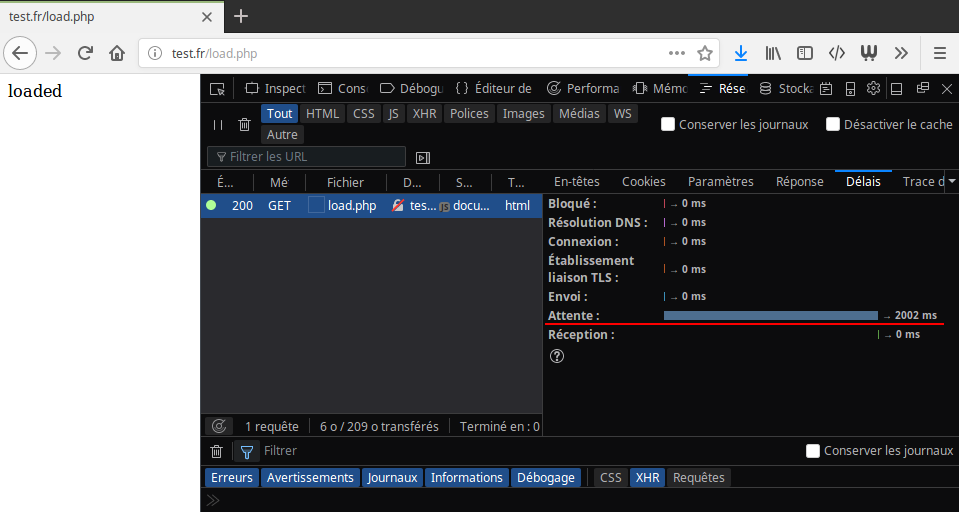
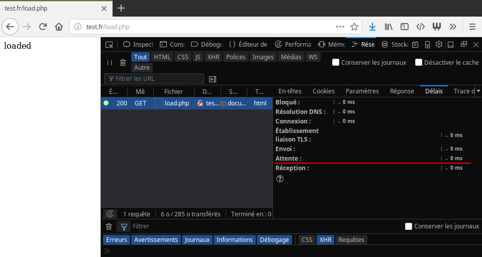
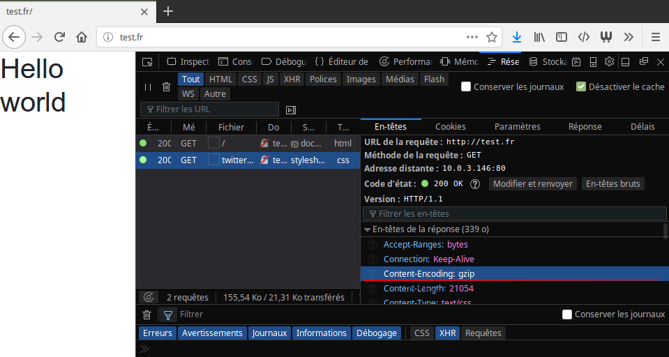

---

title: Optimiser Apache
description: Optimisation des performances d'Apache
date: 2018-04-03 18:00:00 +0200
tags: [apache, linux, seo]
categories: tutorial
image: ./images/apache.svg
lang: fr
---

Dans mon [précédent article](/tutorial/2017/11/16/installer-apache.html) je vous
expliquait comment installer un serveur[Apache][apache] dans un container [LXC][lxc].

La configuration de base est d'[Apache][apache] est souvent suffisante mais une
configuration plus pointue peut vous économiser de la bande passante et de la
ressource. Vous serez donc en mesure de tenir une charge plus importante et aussi d'
améliorer votre temps de réponse. De plus, en respectant les
[conseils Google][googleguidelines] vous améliorerez aussi votre référencement.

## La mise en cache

Quoi de mieux que de réduire la taille des fichiers? Ne pas les envoyer!

Il s'agit du principe de la **mise en cache**. Lors de la première requête, nous
spécifions un [en-tête HTTP][http_headers] qui définit une **date d'expiration**
de la page. La page est stockée dans un fichier par le navigateur jusqu'à cette
date. Lors de la prochaine visite, si la date est toujours valide, le navigateur
utilisera cette page sans passer par le serveur.

Nous allons utiliser [PHP][php] pour simuler un temps de chargement
assez long. On commence par l'installer:

```bash
apt install php libapache2-mod-php
a2enmod php7.0
systemctl reload apache2
```

> La version de PHP à activer peut différer en fonction de celle qui a été
> installée

On crée un petit script qui va retarder l'affichage de la page grâce à la
fonction [`sleep`][php_sleep]:

```bash
echo '<?php sleep(2); echo "loaded" ?>' > /var/www/test.fr/public/load.php
```

On se rend sur <http://test.fr/load.php>. La page met plus de deux secondes à
s'afficher (normal):



Mettons maintenant en place ce cache. [Apache][apache] utilise deux modules pour
ça: `headers` qui permet de modifier l'en-tête des réponses et `expires` qui
ajoute l'entête `expires`. On commence par les activer:

```bash
a2enmod expires headers
```

On rajoute la directive `ExpiresActive on` pour activer l'option et on utilise
`ExpireDefault` pour spécifier le temps de mise en cache. `ExpireDefault`
utilise en argument le temps de mise en cache. Ce temps s'exprime avec:

- **une lettre**: `A` pour _Access_ (dernière visite) et `M` pour _Modification_
- **un chiffre**: désignant le temps de secondes de mise en cache

Par exemple `A10` pour le garder 10 secondes après le dernier accès ou `M60`
pour le garder 1 minutes après la dernière modification.

Et on rajoute une directive de cache pour les images.

```apache
# active la mise en cache
<IfModule mod_header.c>
  Header append Cache-Control public
</IfModule>
# définis un cache d'une heure après la dernier accès
<IfModule mod_expires.c>
  ExpiresActive on
  ExpiresDefault A3600
</IfModule>
```

On redémarre Apache

```bash
systemctl reload apache2
```

Et lorsqu'on rafraîchis notre navigateur, la différence est flagrante!



## La compression

La compression permet d'économiser de la bande passante en comprimant les
données (HTML, CSS, JavaScript, etc..). L'objectif est de réduire la taille des
données avant de les envoyer. Le navigateur du client s'occupera de les
décompresser avant de les interpréter.

Cette fonctionnalité demande l'activation du module [mod_deflate][mod_deflate].
Pour cela on utilise `a2enmod`:

```bash
a2enmod headers deflate
```

On ajoute maintenant une nouvelle directive à notre fichier de configuration
_test.fr.conf_.

```bash
vi /etc/apache2/sites-availables/test.fr.conf
```

```apache
# activation du module de compression
<IfModule mod_deflate.c>
  SetOutputFilter DEFLATE
  DeflateCompressionLevel 9

  # compression des fichiers HTML / CSS
  <Location />
   AddOutputFilterByType DEFLATE text/html
   AddOutputFilterByType DEFLATE text/css
  </Location>
</IfModule>
```

Et il suffit de redémarrer Apache

```bash
systemctl reload apache2
```

Sur le PC client, ouvrez l'inspecteur réseaux avec <kbd>F12</kbd> et actualisez
la page.



L'inspecteur nous inique que sur 155,54 ko, **21,31 ko ont été transférés**! Il
s'agit donc d'un gain à ne pas négliger car il fera la différence pour les
petites connections.

## Supprimer les modules inutiles

Certains modules sont activés par défaut lors de l'installation. Ceux-ci:

- nous prennent de la **place sur le serveur**
- sont potentiellement une **faille de sécurité**
- utilise éventuellement une partie des **ressource**

Il convient donc de les supprimer.

Pour les connaître, il suffit de lister les fichiers contenu dans le dossier
_/etc/apache2/mods-enabled_:

```bash
ls /etc/apache2/mods-enabled/
```

Ensuite, il suffit d'utiliser `a2dismod` pour les désactiver (attention à tester
sur un serveur de test avant de le faire en production).

## Désactiver les logs d'accès

Les logs d'accès sont définit dans votre **Vhost** avec la directive

- `ErrorLog` pour les logs erreurs
- `CustomLog` pour les logs d'accès

Pour améliorer les performances, on peut désactiver les logs d'accès avec
`a2disconf`.

```bash
a2disconf other-vhosts-access-log
```

> Pensez bien à supprimer la directive de votre _Vhost_

## HTTP2

Il s'agit de la nouvelle version du protocole HTTP. IL apporte de nombreuses
améliorations.

Ne peux être utilisé que en HTTPS. Si vous n'avez pas encore activé le HTTPS,
considérez vraiment [Let's Encrypt][letsencrypt] qui vous délivre
un certificat rapidement & gratuitement. L'installation est très rapide avec
[Certbot][certbot] qui s'occupe de mettre à jour votre
configuration [Apache][apache]. Pour l'installer, suivez la
[documentation officielle][certbot-doc].

```bash
sudo a2enmod ssl http2
```

Et on édite notre Vhost en ajoutant la directive.

```apache
Protocols h2 http/1.1
SSLEngine on
```

> Malheureusement nous ne pouvons pas tester sur notre environnement local car nous
> ne possédons pas le nom de domaine _test.fr_. Il faudra faire la manipulation
> directement sur votre environnement de production.

## D'autres paramètres en vrac

### La recherche de DNS

[`HostnameLookups`][hostnamelookups] permet de rechercher le nom de domaine du
visiteur afin de le logger. Le problème est qu'une recherche DNS est effectuée à
chaque visite. On peut désactiver cette options simplement dans notre **Vhost**:

```apache
HostnameLookups off
```

### _.htaccess_

Les fichiers _.htaccess_ permettent d'écraser les options renseignées dans le
fichier de configuration [Apache][apache]. Un appel système est effectué pour
vérifier qu'un fichier _.htaccess_ existe ou non. Si votre projet n'utilise pas
de ces fichiers, vous pouvez les désactiver l'option `AllowOverride`:

```apache
<Directory "public/">
  AllowOverride None
</Directory>
```

### Durée de vie d'une connexion TCP

[`KeepAliveTimeout`][keepalivetimeout] détermine la durée d'attente de la
prochaine requête. Par défaut la valeur est fixée à 5 secondes ce qui signifie
qu'un processus attendra 5 secondes maximum avant de se fermer. Nous pouvons l'
abaisser à 2 secondes. Il suffit d'ajouter la directive à notre **Vhost**.

```apache
KeepAliveTimeout 2
```

### Les liens symboliques

L'option `FollowSymLinks` autorise [Apache][apache] à traverser les liens
symbolique pour récupérer des ressources (des images par exemple). Lorsque cette
option est désactivée, un appel système est effectuée pour vérifier que le
dossier n'est pas un lien symbolique. Donc autant activer l'option si cela est
possible. Dans votre **Vhost**, ajouter la directive suivante:

```apache
<Directory "public/">
  Options FollowSymLinks
</Directory>
```

## Liens intéressants

- [https://buzut.fr/configuration-dun-serveur-linux-apache2](https://buzut.fr/configuration-dun-serveur-linux-apache2)
- [http://artisan.karma-lab.net/optimisation-dapache](http://artisan.karma-lab.net/optimisation-dapache)
- [ftp://ftp.traduc.org/pub/lgazette/html/2006/123/lg123-D.html](ftp://ftp.traduc.org/pub/lgazette/html/2006/123/lg123-D.html)

[lxc]: https://linuxcontainers.org/fr/
[apache]: https://fr.wikipedia.org/wiki/Apache_HTTP_Server
[fondationapache]: https://fr.wikipedia.org/wiki/Fondation_Apache
[marketshareapache]: https://www.developpez.com/actu/129511/Serveurs-Web-Nginx-detient-desormais-un-tiers-des-parts-de-marche-tandis-qu-Apache-chute-en-dessous-des-50-pourcent-d-apres-W3Tech/
[http_headers]: https://developer.mozilla.org/fr/docs/HTTP/Headers
[letsencrypt]: https://letsencrypt.org
[certbot]: https://certbot.eff.org
[certbot-doc]: https://certbot.eff.org/docs/
[php]: http://php.net/
[php_sleep]: http://php.net/manual/fr/function.sleep.php
[mod_deflate]: https://httpd.apache.org/docs/current/fr/mod/mod_deflate.html
[hostnamelookups]: https://httpd.apache.org/docs/current/fr/mod/core.html#hostnamelookups
[keepalivetimeout]: https://httpd.apache.org/docs/current/fr/mod/core.html#keepalivetimeout
[googleguidelines]: https://developers.google.com/speed/docs/insights/v2/reference/
