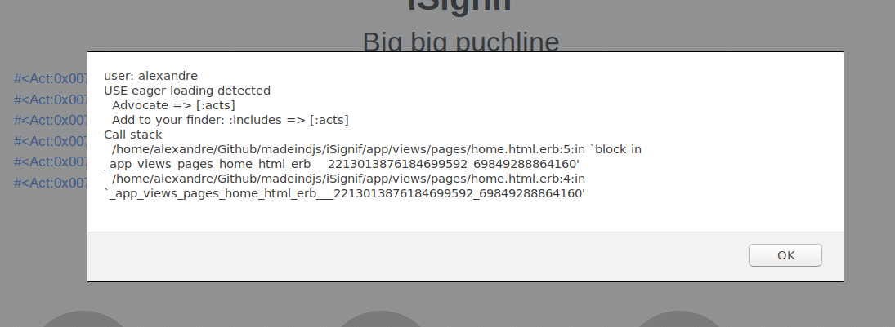

---

title: A la chasse aux requêtes N+1 avec Ruby on Rail
date: 2018-06-22 17:30:00 +0200
tags: [ruby, rails, sql, performance, optimization]
image: ./images/n1query.png
categories: tutorial
lang: fr
---

Les **requêtes N+1** sont une plaie qui peuvent avoir un **impact énorme sur les performances** d'une application. Ce phénomène se produit souvent lorsqu'on utilise un **ORM**.

> T'inquiètes pas, je m’occupe de tout.
>
> _Active Record_ de Ruby on Rails

L'ORM génère **automatiquement** les requêtes SQL et nous évite ainsi de les taper à la main. Cet outil bien pratique est à **double tranchant** car il peut générer un **grand nombre** de requête SQL.

## Exemple

Voici un exemple où l'on veut récupérer tous les utilisateurs qui ont déjà créé une recette. Sans réfléchir, on serait tenté de faire plus ou moins comme ça:

```ruby
users = Recipe.all.map{|recipe| recipe.user}
# SELECT "recipes".* FROM "recipes"
# SELECT  "users".* FROM "users" WHERE "users"."id" = ? LIMIT 1  [["id", 1]]
# SELECT  "users".* FROM "users" WHERE "users"."id" = ? LIMIT 1  [["id", 2]]
```

On voit ici qu'on génère trois requêtes.

- `Recipe.all` = 1 requête pour récupérer les recettes
- `recipe.user` = 1 requête `SELECT "users".* FROM "users" WHERE "users"."id" = ? LIMIT 1 [["id", 1]]` par recette

Donc, si nous avons **1000 recettes** en base, nous générons **1001 requêtes SQL**.

<iframe width="560" height="315" src="https://www.youtube.com/embed/S9k7Avk5jJE" frameborder="0" allow="autoplay; encrypted-media" allowfullscreen></iframe>

## Comment corriger?

C'est là qu'intervient `includes`. `includes` va **pré-charger** les objets enfants dans une seule requête. Son utilisation est très facile. Si on reprend l'exemple précédent

```ruby
users = Recipe.includes(:user).all.map{|recipe| recipe.user}
# SELECT "recipes".* FROM "recipes"
# SELECT "users".* FROM "users" WHERE "users"."id" IN (?, ?) [["id", 1],["id", 2]]
```

Et voilà:

- `Recipe.all` = 1 requête `SELECT "recipes".* FROM "recipes"`
- `recipe.user` = 1 requête `SELECT "users".* FROM "users" WHERE "users"."id" IN (1, 2)`

`includes` ne s'arrête pas là et nous permet même de précharger les sous-liaisons très facilement:

```ruby
Recipe.includes(comments: :user)
```

Active Record est **magique**!

## Comment prévenir?

Nous avons vu qu'il est malheureusement **très facile** de créer une requête N+1. Heureusement, il existe une _gem_ qui permet de nous **alerter** lorsque ce genre de situation arrive: [Bullet][bullet]. [Bullet][bullet] va nous prévenir (par mail, [notification growl](http://growl.info/), console, etc..) lorsqu’il trouve une requête N+1.

Pour l'installer, on ajoute la _gem_ au _GemFile_

```ruby
# Gemfile

group :development do
  gem 'bullet'
end
```

On n'oublie pas de lancer un `bundle install` pour installer la dépendance et on crée un _initializer_ pour configurer [Bullet][bullet].

```ruby
# config/initializers/bullet.rb

Rails.application.config.after_initialize do
  Bullet.enable = true
  Bullet.alert = true
end
```

> Changer la configuration nécessite le redémarrage du serveur

Ici j'ai seulement activé une [`window.alert`](https://developer.mozilla.org/fr/docs/Web/API/Window/alert) JavaScript. Il suffit ensuite d'utiliser l'application normalement et lorsque l'on rencontrera une requête N+1:



[bullet]: https://github.com/flyerhzm/bullet
