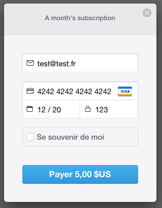
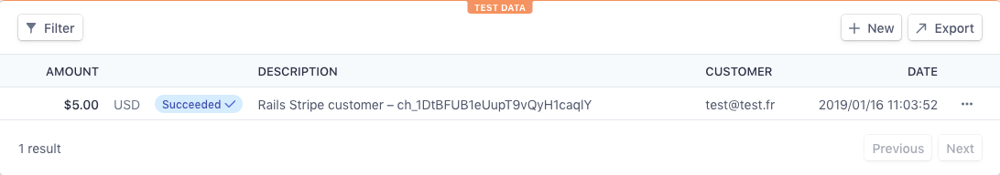
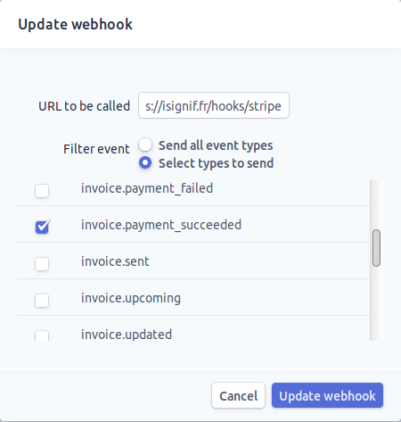
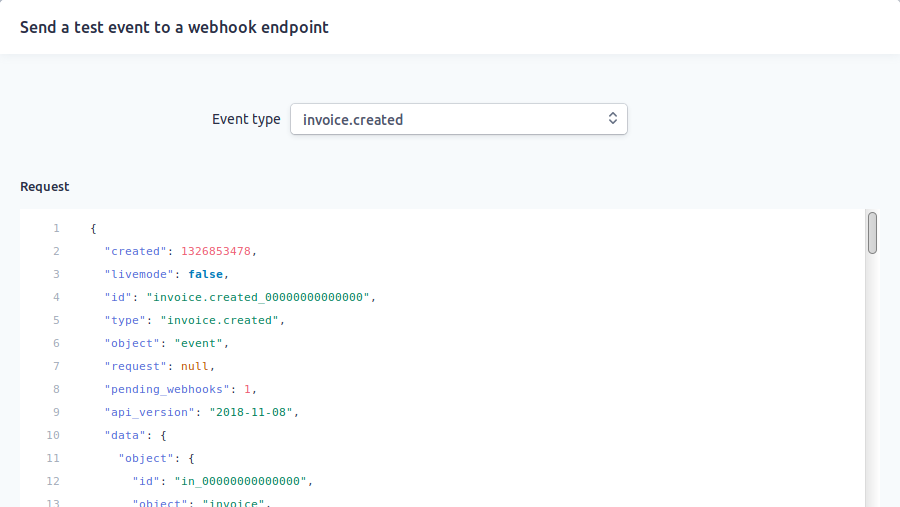

---

title: Connecter une application Rails avec Stripe
date: 2019-02-02 12:30:00 +0200
tags: [rails, stripe, api]
categories: tutorial
image: ./images/stripe.svg
comments: true
lang: fr
---

Pour mon projet [iSignif](https://isignif.fr) j'ai voulu implémenter la fonctionnalité d' **accès restreint** au site uniquement si l'utilisateur bénéficie d'un **compte premium**. Le but final est que l’utilisateur doive souscrire un compte premium afin d'accéder à certaines pages.

Afin d'implémenter cette fonctionnalité, nous avons commencé par analyser le besoin. Le comportement attendu est le suivant:

1. le client bénéficie d'un mois de découverte de notre outil dès son inscription
2. une fois son _solde de jours premium_ épuisé, il reçoit un mail lui indiquant qu'il va falloir racheter des jours
3. l'utilisateur met à jour son solde en effectuant un **paiement ponctuel** qui lui rajoute un mois à son solde premium où il souscrit un abonnement qui effectuera un **paiement automatique** au début de chaque mois

Afin d'implémenter cela, j'ai rapidement fait le tour des solutions de paiement existantes (PayPal, BNP, etc..). Il s'est avéré que [Stripe](https://stripe.com) était le meilleur compromis.


> Stripe est une société américaine qui a pour but de simplifier les paiements en ligne. Créée en 2010, Stripe pèse maintenant plus de 10 milliards!

J'ai choisi Stripe car ses avantages sont:

- le client peut payer sans avoir un compte ouvert chez Stripe
- les tarifs sont assez "raisonnables" _(1,4% + 0,25€ par transaction pour les cartes européennes)_
- la facilité de la mise en place car, en plus de proposer une belle API, Stripe propose des librairies pour les langages les plus utilisés ([PHP](https://github.com/stripe/stripe-php), [Pyhton](https://github.com/stripe/stripe-python), [Ruby](https://github.com/stripe/stripe-ruby), [Java](https://github.com/stripe/stripe-java) et même [Go](https://github.com/stripe/stripe-go))
- une [excellente documentation](https://stripe.com/docs)

De plus, Stripe va bien plus loin qu'une _simple_ solution de paiement puisqu'il propose tout un écosystème pour gérer des clients, des factures, des produits, etc...

Dans cet article je vais donc retracer le développement de la fonctionnalité en essayant d'être le plus générique possible. Je précise aussi avant de commencer que ce n'est pas un article sponsorisé et je n'ai pas reçu d'argent de la part de Stripe (j'aurais bien voulu...).

**TLDR**: Stripe est très simple à mettre en place et nous permet vraiment de complètement **déléguer** la gestion des paiement. Cela permet de se focaliser sur son business et c'est quelque chose d'inestimable pour un projet qui débute.

## Sommaire

- TOC
  {:toc}

## Implémentation du mode premium

Dans cette première partie, je vais vous parler de l'implémentation de la fonctionnalité _premium_. Ici on va juste coder le comportement attendu sans toucher à Stripe pour le moment (patience...).

### Modification du modèle `User`

Nous allons donc commencer mettre en place un système de restriction de certaines pages aux utilisateurs _premium_.

L'idée est d'ajouter un attribut `premium_until` de type [`DateTime`](https://api.rubyonrails.org/classes/DateTime.html) qui contiendra la date de validité du compte premium. On ajoute donc cette colonne pour la table des `users`.

```bash
rails g migration add_premium_until_to_users premium_until:date
```

Cette commande va générer la migration suivante:

```ruby
# db/migrate/20190116132207_addpremiumuntil_to_users.rb
class AddPremiumUntilToUsers < ActiveRecord::Migration[5.2]
  def change
    add_column :users, :premium_until, :date
  end
end
```

Vu que nous sommes généreux, nous allons aussi créer une migration supplémentaire afin d' **offrir un mois** à tous les utilisateurs existants:

```bash
rails g migration offer_one_monthspremiumto_users
```

On boucle juste sur tous les utilisateurs existants

```ruby
# db/migrate/20190116132207_add_premium_until_to_users.rb
# ...
def up
  premium_until_offer = DateTime.now + 1.month
  User.all.each { |user| user.update! premium_until: premium_until_offer }
end
```

Et voilà.

### Création de la logique premium

Nous avons maintenant une belle colonne `premium_until` qui contient la **date de validité** du compte premium. Nous voulons **créer** une méthode `User#increment_premium` qui sera appelée à chaque fois qu'un paiement est réceptionné. Celle-ci va simplement ajouter un mois à l'attribut `premium_until`.

Créons les tests unitaires qui définissent le comportement attendu de cette fonction. Cette méthode est **très importante** donc nous allons couvrir tous les cas possibles:

- lorsque l'utilisateur possède déjà un solde de jours

```ruby
# test/models/user_test.rb
test 'should offer one month premium to user' do
  user = User.create!(
    premium_until: (Date.today + 5.days)
    # ...
  )

  assert_equal (Date.today + 1.month + 5.days), user.premium_until
end
```

- lorsque l'utilisateur ne possède pas encore de solde de jours

```ruby
# test/models/user_test.rb
test 'should set correct premium_until for never premium user' do
  user = User.new
  user.increment_premium
  assert_equal (Date.today + 1.month), user.premium_until
end
```

- vérifie que l'on ajoute un mois à partir d'aujourd’hui pour un utilisateur qui vient de réactiver son compte après une inactivité

```ruby
# test/models/user_test.rb
test 'should set correct premium_until for past-premium user' do
  user = User.new(premium_until: (Date.today - 1.year))
  user.increment_premium
  assert_equal (Date.today + 1.month), user.premium_until
end
```

Je pense que ces tests suffisent à couvrir tous les cas possibles. Nous avons écrit beaucoup de tests mais l'implémentation est très rapide:

```ruby
# app/models/user.rb
class User < ApplicationRecord
  before_create :increment_premium

  def increment_premium
    if premium_until.nil? || (premium_until < Date.today)
      self.premium_until = Date.today
    end
    self.premium_until += 1.month
  end
  # ...
end
```

Et voilà. les tests passent désormais:

```bash
bin/rails test test/models/user_test.rb
# Running:

....
```

### Restrictions actions

L'implémentation de la restriction est vraiment facile mais commençons par écrire les tests unitaires. On va donc créer deux _fixtures_ _(Les fixtures sont des données insérées dans la base de données afin de tester l'application)_ une représentant un utilisateur premium et une autre un utilisateur expiré.

```yml
# test/fixtures/users.yml
premium_advocate:
  premium_until: <%= DateTime.now + 1.month %>
  # ...

expired_advocate:
  premium_until: <%= DateTime.now - 1.month %>
  # ...
```

Maintenant, imaginons une page autorisée seulement aux utilisateurs premium. Le test est assez facile:

1. On connecte un utilisateur
2. On accède à la page
3. on vérifie que la réponse est 200 (= _success_) si l'utilisateur est premium et sinon on vérifie que l'utilisateur est redirigé vers la page de paiement Stripe

Voici donc l'implémentation des tests:

```ruby
# test/controllers/acts_controller_test.rb
class ActsControllerTest < ActionDispatch::IntegrationTest

  test 'should forbid get index for non-premium user' do
    login users(:expired_advocate)
    get acts_url
    assert_response root_path
  end

  test 'should get index for premium user' do
    login users(:premium_advocate)
    get acts_url
    assert_response :success
  end

  # ...
end
```

A ce moment, si vous lancez les test, vous obtiendrez une belle erreur de ce genre:

```
ActsControllerTest#test_should_forbid_get_index_for_non-premium_user
Expected response to be a <3XX: redirect>, but was a <200: OK>
```

L'implémentation pour le faire passer est assez facile. Il suffit de créer une méthode qui va vérifier que l'attribut `premium_until` de l'utilisateur connecté est supérieur à `DateTime.now`. Ensuite il suffit d’appeler cette méthode en utilisant un [_hook_ dans le contrôleur](https://api.rubyonrails.org/classes/AbstractController/Callbacks/ClassMethods.html#method-i-before_action). Voici le code

```ruby
# app/controllers/acts_controller.rb
class ActsController < ApplicationController
  before_action :redirect_if_not_premium, only: %i[index]
  # ...

  private

  def redirect_if_not_premium
    redirect_to root_path if current_user.nil? or current_user.premium_until < DateTime.now
  end
end
```

> La méthode `current_user` me permet de récupérer l'utilisateur connecté à l'application. Pour l'implémenter, je vous recommande d'utiliser [Authlogic](https://github.com/binarylogic/authlogic)

Et voilà. Le test devrait désormais passer! La création de la logique pour le mode utilisateur est maintenant terminée. Passons (enfin) à Stripe!

## Paiement ponctuel

Nous avons donc mis en place la logique pour restreindre certaines pages aux utilisateurs premium. Nous avons aussi créé la méthode qui ajoutera un mois de compte premium à un utilisateur. Il ne reste plus qu'à appeler cette méthode lorsqu'un paiement est effectué.

Tout d'abord, pour utiliser Stripe, il faut se créer un compte qui vous permettra d'obtenir une _clé d'API_. Une fois ceci fait, l'intégration à votre application Rails est très facile car [Stripe propose une gemme](https://github.com/stripe/stripe-ruby/)! Bien sûr, nous allons l'utiliser ici.

Commençons donc par ajouter cette gemme à notre projet:

```bash
bundle add stripe
```

Dans cette première version nous allons simplement mettre en place un paiement ponctuel Stripe et appeler `User#increment_premium` si tout se passe bien. Dans le jargon de Stripe, un simple paiement est une _charge_.

On va donc créer un contrôleur `charges` qui va contenir deux actions:

- `new` qui va simplement proposer un formulaire pour payer
- `create` qui recevra la réponse de Stripe

Générons donc tout ça avec la commande `rails generate`:

```bash
rails generate controller charges new create
```

Il ne nous reste qu'à modifier un peu le code généré par Rails. Tout d'abord on modifie les routes:

```ruby
# config/routes.rb
Rails.application.routes.draw do
  # ...
  resources :charges, only: %i[new create]
  # ...
end
```

On implémente ensuite les actions dans le contrôleur:

```ruby
# app/controllers/charges_controller.rb
class ChargesController < ApplicationController
  # display Stripe form to make a new payment
  def new; end

  #  & check all data from Sripe
  def create
    # Amount in cents
    @amount = 500

    # get customer from POST params
    customer = Stripe::Customer.create(
      email: params[:stripeEmail],
      source: params[:stripeToken]
    )

    begin
      charge = Stripe::Charge.create(
        customer: customer.id,
        amount: @amount,
        description: 'Rails Stripe customer',
        currency: 'eur'
      )
      current_user.increment_premium!
    rescue Stripe::CardError => e
      flash[:error] = e.message
      redirect_to new_charge_path
    end
  end
end
```

Ca fait beacoup de code . Découpons un peu la méthode `create`:

1. `Stripe::Customer.create` va enregistrer l'utilisateur chez Stripe. Elle va s'occuper de faire toutes les vérifications pour nous (validité de carte, informations transmises, etc...)
2. `Stripe::Charge.create` va créer la _charge_ en la liant au _customer_ que nous venons de créer
3. Nous appelons la méthode `increment_premium` pour ajouter du crédit à l'utilisateur

Rien de très compliqué. Maintenant, on modifie un peu les vues et on génère un formulaire:

```erb
<!-- app/views/charges/new.html.erb -->
<h1>Souscrire à un abonnement mensuel</h1>
<p>Actuellement, votre compte premium est disponible jusqu'au <%= current_user.premium_until.strftime('%d/%m/%Y') %></p>
<%= form_tag charges_path do %>
  <script src="https://checkout.stripe.com/checkout.js" class="stripe-button"
          data-key="<%= Rails.application.secrets.stripe[:publishable_key] %>"
          data-description="A month's subscription"
          data-amount="500"
          data-locale="auto"></script>
<% end %>
```

```erb
<!-- app/views/charges/create.html.erb -->
<h1>Votre paiement a été accepté</h1>
<p>Le paiement a été effectué. Votre compte premium à été étendu au <%= current_user.premium_until.strftime('%d/%m/%Y') %></p>
```

On termine par la configuration. Il suffit de récupérer les clés API via l'interface Stripe et des les ajouter dans le fichier `secrets.yml`

```yaml
# config/secrets.yml
development:
  stripe:
    publishable_key: pk_test_azerty
    secret_key: sk_test_clef_a_ne_pas_commiter

test: &development

production:
  stripe:
    publishable_key: pk_live_azerty
    secret_key: sk_live_clef_a_ne_pas_commiter
```

> Évidemment, il faut renseigner _votre_ propre clé ici

Et maintenant de créer la configuration nécessaire dans un _initializer_ spécifique à Stripe:

```ruby
# config/initializers/stripe.rb
Rails.configuration.stripe = {
  publishable_key: Rails.application.secrets.stripe[:publishable_key],
  secret_key: Rails.application.secrets.stripe[:secret_key]
}

Stripe.api_key = Rails.application.secrets.stripe[:secret_key]
```

Une fois la première version mise en place, il suffit de tester que tout se passe bien.

> Au risque de vous décevoir, je n'ai rien inventé et j'ai quasiment tout pompé sur [le guide de Stripe](https://stripe.com/docs/checkout/rails).

Pour tester, on lance le serveur Rails et on se connecte sur <http://localhost:3000/charges/new>. Un bouton vous emmènera sur le formulaire de Stripe:



J'ai volontairement utilisé le numéro de carte `4242 4242 4242 4242` qui est une carte de test. Certaines cartes vous permettent de simuler des erreurs. La liste complète des cartes de test est disponible [ici](https://stripe.com/docs/testing#cards)

Une fois le formulaire envoyé, vous êtes redirigé vers la page `charges#create` qui vous confirme votre achat. Vous pouvez retrouver le paiement sur Stripe dans la section _payments_:



### Sauvegarde du _cutomer token_

Nous allons effectuer une petite modification à l'implémentation proposée par Stripe. Nous voulons sauvegarder le _customer_ créé par Stripe afin de le réutiliser s'il paie une nouvelle fois. On va donc ajouter une colonne `users.stripe_token`.

```
rails g migration add_stripe_token_to_users stripe_token:string
```

Nous allons créer un _concern_ qui va s'occuper de récupérer ou créer un _customer_ Stripe:

> Si vous n'êtes pas à l'aise avec les _concerns_, j'en parle dans un [précédent article](http://rousseau-alexandre.fr/tutorial/2018/12/03/zip-active-storage.html#factorisation).

```ruby
# app/controllers/concerns/stripe_concern.rb
module StripeConcern
  extend ActiveSupport::Concern

  protected

  # Try to retreive Stripe customer and create if not already registered
  # @params [User]
  # @return [Stripe::Customer]
  def create_or_retrieve_customer(user)
    customer = retrieve_stripe_customer(user)

    if customer.nil?
      customer = Stripe::Customer.create email: params[:stripeEmail], source: params[:stripeToken]
      user.update! stripe_token: customer.id
    end

    customer
  end

  private

  # @params [User]
  # @return [Stripe::Customer|Nil]
  def retrieve_stripe_customer(user)
    return nil if user.stripe_token.nil?

    begin
      customer = Stripe::Customer.retrieve user.stripe_token
      return customer
    rescue Stripe::InvalidRequestError
      # if stripe token is invalid, remove it!
      user.update! stripe_token: nil
      return nil
    end
  end
end
```

Il suffit maintenant de modifier un peu notre contrôleur pour l'utiliser.

```ruby
# app/controllers/charges_controller.rb
class ChargesController < ApplicationController
  include StripeConcern
  # ...

  def create
    # Amount in cents
    @amount = 500

    customer = create_or_retrieve_customer(current_user)

    begin
      charge = Stripe::Charge.create(
        customer: customer.id,
        amount: @amount,
        description: 'Rails Stripe customer',
        currency: 'eur'
      )
      current_user.increment_premium!
    rescue Stripe::CardError => e
      flash[:error] = e.message
      redirect_to new_charge_path
    end
  end
end
```

Et voilà! Le fonctionnement est identique mais désormais nous récupérons le client s'il existe déjà. Nous pouvons aussi nous passer du bouton Stripe si l'utilisateur a déjà un token:

```erb
<!-- app/views/charges/new.html.erb -->
<h1>Souscrire à un abonnement mensuel</h1>
<p>Actuellement, votre compte premium est disponible jusqu'au <%= current_user.premium_until.strftime('%d/%m/%Y') %></p>
<%= form_tag charges_path do %>
  <% if current_user.stripe_token %>
    <%= submit_tag 'Payer avec votre compte Stripe' %>
  <% else %>
    <script src="https://checkout.stripe.com/checkout.js" class="stripe-button"
            data-key="<%= Rails.application.secrets.stripe[:publishable_key] %>"
            data-description="A month's subscription"
            data-amount="500"
            data-locale="auto"></script>
  <% end %>
<% end %>
```

## Abonnement

Ne lâchez pas, nous avons presque terminé. Une des dernière fonctionnalité à créer est de proposer un abonnement. L'utilisateur pourra ainsi souscrire un abonnement qui enclenchera un paiement automatique au début du mois. Dans le jargon de Stripe, cela s'appelle une [_subscriptions_](https://stripe.com/docs/billing/subscriptions/products-and-plans).

> Chaque plan est joint à un produit qui représente (...) le service offert aux clients. Les produits peuvent avoir plus d'un plan, reflétant les variations de prix et de durée - comme les prix mensuels et annuels à des taux différents. Il existe deux types de produits: les biens et les services. (...) qui sont destinés aux abonnements.

### Création du plan

Créons donc notre premier produit [la](https://stripe.com/docs/api/plans/create?lang=ruby) en utilisant [la gemme Stripe](https://github.com/stripe/stripe-ruby/). Voici un exemple avec la console Rails (Vous pouvez faire la même chose en utilisant l'interface d'administration).

```ruby
2.6.0 :001 > product= Stripe::Product.create name: 'Abonnement compte premium', type: 'service'
 => #<Stripe::Product:0x3fe4f20a1420 id=prod_EMb13PJreiAcF2> JSON: {
2.6.0 :002 > plan = Stripe::Plan.create amount: 5000, interval: 'month', product: product.id, currency: 'eur', id: 'premium-monthly'
 )
  => #<Stripe::Plan:0x2ab3e0b46d24 id=premium-monthly> JSON: {
```

> Là encore je n'ai rien inventé, tout est [Dans la documentation de Stripe](https://stripe.com/docs/api/subscriptions/object?lang=ruby)

Nous obtenons donc un belle instance Ruby correspondant à un _Plan_. Nous allons juste noter l' `id` et le noter dans le fichier `secret.yml`:

```yaml
# config/secrets.yml
development:
  stripe:
    premium_plan_id: premium-monthly
    # ...
```

### Création de la logique

Comme nous avons créé un contrôleur `charges`, nous allons en créer un nouveau nommé `subscriptions` avec deux méthodes:

- `new` qui va simplement proposer un formulaire pour payer
- `create` qui recevra la réponse de Stripe

Utilisons une fois de plus la commande `rails generate`

```bash
rails generate controller subscriptions new create
```

Cette méthode n'est pas parfaite, il faut modifier un peu les routes

```ruby
# config/routes.rb
Rails.application.routes.draw do
  resources :subscriptions, only: %w[new create]
  # ...
end
```

L'implémentation du `SubscriptionsController` est quasiment identique au `ChargesController` (c'est pour cela que nous avons utilisé un _concern_ un peu plus haut afin d'éviter de dupliquer le code). Nous devons juste appeler la méthode `Stripe::Charge.create`

```ruby
class SubscriptionsController < ApplicationController
  include StripeConcern

  before_action :check_login
  before_action :only_advocates

  def new; end

  def create
    customer = create_or_retrieve_customer(current_user)

    begin
      Stripe::Subscription.create(customer: customer.id, items: [{ plan: Rails.application.secrets.stripe[:premium_plan_id] }])
    rescue Stripe::CardError => e
      flash[:error] = e.message
      redirect_to new_subscription_path
    end
  end
end
```

Et les vues:

```erb
<!-- app/views/subscriptions/new.html.erb -->
<h1>Souscrire à un abonnement mensuel</h1>
<p>Abonner vous afin de recharger votre compte automatiquement tous les mois</p>
<%= form_tag subscriptions_path do %>
  <% if current_user.stripe_token %>
    <p class="text-center">
      <%= submit_tag t('premium.pay'), class: 'btn btn-primary btn-lg' %>
    </p>
  <% else %>
    <script src="https://checkout.stripe.com/checkout.js" class="stripe-button"
        data-key="<%= Rails.application.secrets.stripe[:publishable_key] %>"
        data-image="<%= image_url 'favicon.png' %>"
        data-name="iSignif SAS"
        data-description="Compte premium pendant un mois"
        data-email="<%= current_user.email %>"
        data-locale="auto"></script>
  <% end %>
<% end %>
```

```erb
<!-- app/views/subscriptions/create.html.erb -->
<h1><%= @title %></h1>
<p>Le prélèvement automatique est maitenant configuré</p>
```

Et voilà. Nous pouvons désormais souscrire un abonnement.

### Mise en place du _Webhook_

Nous avons mis en place un paiement mensuel mais nous voulons être notifié des paiements effectués au début du mois. Dans notre cas, le _workflow_ type est le suivant:

1. l’utilisateur effectue une demande d'abonnement
2. Stripe crée un abonnement pour cette utilisateur
3. lorsque l'abonnement est renouvelé (c-à-d. lorsque Stripe facture le client et qu'il est facturé de nouveau).

Stripe envoie une requête pour signaler que le paiement a été effectué par le biais du _hook_. Les _Webhook_ sont simplement des routes que nous mettons à disposition pour recevoir les requêtes de la part de Stripe. Une fois la route créée, nous devons communiquer l'URL à Stripe via l'interface d'administration de Stripe (cela se fait très facilement).



> Notez que j'ai choisi de ne recevoir que le signal `invoice.payment_succeeded` qui est envoyé lorsqu'une facture est payée. Encore une fois je n'invente rien, tout est [dans la documentation de Stripe](https://stripe.com/docs/billing/webhooks#tracking)

Générons une route avec Rails.

```bash
rails g controller  hooks stripe --no-assets --no-helper
```

Nous allons juste supprimer la vue que Rails vient de nous créer et passer la route accessible avec le verbe `POST`:

```bash
rm -r app/views/hooks
```

```ruby
# config/routes.rb
Rails.application.routes.draw do
  post 'hooks/stripe'
  # ...
end
```

Il suffit maintenant d'ajouter une méthode dans le contrôleur qui recevra la requête de Stripe.Comme d'habitude, commençons par les tests.

### Test fonctionnels

C'est toujours compliqué de tester l'intégration d'un API donc j'ai simplement choisi de simuler une requête de la part de Stripe et de vérifier si notre contrôleur ajoute du crédit à l'utilisateur.

pour cela, j'ai simplement copié/collé les paramètres envoyés par Stripe via leur [interface de test des webhooks](https://dashboard.stripe.com/test/webhooks/).



Une fois la requête copiée, je l'ai transformée en `Hash` Ruby en ne gardant que les paramètres qui m'intéressent.

```ruby
# test/controllers/hooks_controller_test.rb
# ...
class HooksControllerTest < ActionDispatch::IntegrationTest
  # Stripe webook params copied from <https://dashboard.stripe.com/test/webhooks>
  STRIPE_INVOICE_SUCCEEDED_PARAMS = {
    id: 'invoice.payment_00000000000000',
    type: 'invoice.payment_succeeded',
    # ...
    data: {
      object: {
        customer: 'cus_00000000000000',
        # ...
      }
    },
    # ...
  }.freeze

  # ...
end
```

Maintenant il suffit d'envoyer une requête `POST` et de vérifier que notre utilisateur est incrémenté.

```ruby
# test/controllers/hooks_controller_test.rb
# ...
class HooksControllerTest < ActionDispatch::IntegrationTest
  # ...

  setup do
    @user = users(:one_advocate)
  end

  test 'Stripe hook should add premium days to the given user' do
    old = user.premium_until
    post hooks_stripe_url, params: STRIPE_INVOICE_SUCCEEDED_PARAMS
    assert_response :success
    user.reload
    assert_operator old, :<=, user.premium_until
  end
end
```

Et voilà. L'implémentation est très simple:

```ruby
# app/controllers/hooks_controller.rb

class HooksController < ApplicationController
  protect_from_forgery except: [:stripe]

  def stripe
    if is_payment_succeeded?
      advocate = retrieve_user

      advocate.increment_premium! unless advocate.nil?
    end

    head :ok, content_type: 'text/html'
  end

  private

  def retrieve_user
    customer_token = params.dig(:data, :object, :customer)
    return nil if customer_token.nil?

    User.where(stripe_token: customer_token).first
  end

  def is_payment_succeeded?
    params[:type] == 'invoice.payment_succeeded'
  end
end
```

> Attention à bien désactiver le `protect_from_forgery` qui va bloquer les requêtes provenant de l'extérieur.

Et voilà, notre paiement récurrent est désormais en place!

### Test en développement

Il suffit d'utiliser un service comme [Ngrok](https://ngrok.com/) ou [Serveo](https://serveo.net/) (je vous recommande ce dernier qui est plus facile à utiliser) afin d'exposer votre application à l’extérieur et ensuite de tester votre _webhook_ via [l'interface de test des webhooks de Stripe](https://dashboard.stripe.com/test/webhooks/). Je ne vais pas vous le montrer ici car nous avons déjà mis en place un test qui le simule pour nous.

## Conclusion

Je vous ai donc démontré via cet article qu'il était très facile de mettre en place un système de paiement récurrent avec Stripe. La documentation quasi parfaite et leur gemme nous simplifient vraiment la tâche.

Mais les fonctionnalités de Stripe ne s'arrêtent pas la. Stripe nous permet aussi de mettre en place un système de facturation (avec la génération de belles factures PDF), de remboursement ou encore de gestion de litiges.

Je pense que pour la création de votre application il est beaucoup plus intelligent de déléguer toutes les tâches de paiement à Stripe et de se concentrer sur son business.
