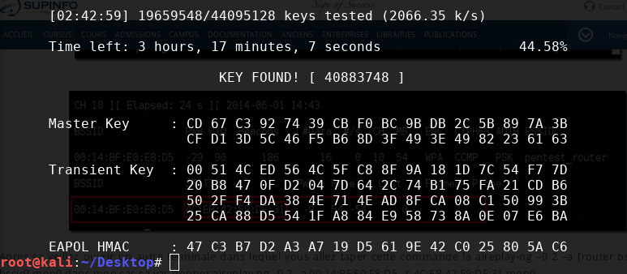

I decided to hack my [my new router](./2017-10-11-installer-bridge-sfr-box-4k.md) just to try and have a fun. Spoiler : it was really easy.

So to make my tests I tried a famous Linux distribution: [Kali Linux](https://www.kali.org/). This distribution have many pre-instaled hacking tools who help us.


I installed Kali Linux in [dual-boot](https://fr.wikipedia.org/wiki/Multiboot) but you can also use it in Live USB mode or with a virtual machine like [VirtualBox](https://www.virtualbox.org/).

## How it works

Here we will use [Aircrack-ng](https://www.aircrack-ng.org/) which is an open-source software suite used to monitor wireless networks and "break" the WEP and WPA keys of Wi-fi networks. The attack will take place in several phases:

- **Preparation** of your network card
- **Analysis** of the Wi-fi target
- **Capturing** a **WPA handshake** _(a connection to the Wi-fi network)_ by disconnecting a device on the Wi-fi
- **WPA handshake** password cracking by _bruteforce_

---

## Preparation

The first step is to activate the **monitor mode** of the network card set up. To do this we list the available network cards with `airmong-ng`. Open a terminal and type:

```bash
airmon-ng
```

> If your network card does not display, it is not compatible. You have to buy one _(a USB Wi-fi dongle is enough)_.

In our case we see that we can use our **wlan0** network card. So we activate the **monitor mode** with the following command::

```bash
airmon-ng start wlan0
```

From here, the network card **wlan0** is no longer available _(you no longer have internet)_, and a new network card appears. It can be found by doing an `ifconfig`. In my case, it is **wlan0mon**..

## Analysis

Now we can _sniff_ the network packets that circulate around us with `airodump`:

```bash
airodump-ng wlan0mon
```

This command will find additional information on Wi-fi including:

- the **BSSID**
- the **CH**annel
- the **AUTH**, the mode of authentication
- the **ESSID**, the name of the router

Among all the lines, my network appears. Remember to write down the information as it will be useful to us.

```
 BSSID              PWR  Beacons    #Data, #/s  CH  MB   ENC  CIPHER AUTH ESSID

 18:D6:C7:85:7E:A0  -45        6        0    0   2  54e  WPA2 CCMP   PSK  TP-LINK_7EA0
```

## Capturing a WPA handshake

A **WPA handshake** takes place when a device is connected to the Wi-fi. Our goal is to capture one in order to recover the encrypted password.

- sniff the Wi-fi and wait for a device to connect to the Wi-fi
- sniff the Wi-fi and cause a disconnection and wait for the device to reconnect

In order to test, I will disconnect my **Blackberry** already connected to it.

### Wi-fi Scan

So we scan the network with the `airodump-ng` command and options:

- `-c` options to specify the channel
- `--bssid`, my router's ID.
- `w` the directory where the output files will be stored

```bash
airodump-ng -c 10 --bssid 18:D6:C7:85:7E:A0 -w tplink  wlan0mon
```

We leave this command in the background, it will produce 3 files, one of which is of type _xml_. This is the one we are interested in because it contains more details about the devices connected to the wi-fi. By opening this one, we can find very easily the information of my Blackberry. Here is an extract of the file:

```xml
<client-mac>94:EB:CD:25:E0:C1</client-mac>
<client-manuf>BlackBerry RTS</client-manuf>
```

### Disconnection

Now that we have all the information, we will send a packet that will **request disconnection** of my Blackberry. We use `aireplay-ng` with the parameters:

- `-0` to send a de-authentication signal.
- `-a` To the BSSID of our Wi-fi.
- `-c` The BSSID of the target
- the network card used

```bash
aireplay-ng -0 2 -a 18:D6:C7:85:7E:A0 -c 94:EB:CD:25:E0:C1 wlan0mon
```

The device disconnects and reconnects automatically. The result is a **WPA Handshake** which is contained in the _tplink.cpa_ file.

## Cracking

Now that we have obtained a packet containing the **encrypted WPA password**, we just have to test several combinations until we find a matching one: this is called a **bruteforce**.

### the dictionary

To find a password we need... passwords! You can find [multi-gigabyte text files of the most commonly used passwords](http://www.wirelesshack.org/wpa-wpa2-word-list-dictionaries.html). In my case, I know that the password of my Wi-fi contains 8 digits. So I'm going to use the `crunch` command to generate all the possible combinations. `crunch` uses several parameters:

1. the minimum length _(8)_
2. the maximum length _(8)_
3. the characters to be used _(0123...9)_

We're sending it all in a _passwords.txt_ file.

```bash
crunch 8 8 12345678 > passwords.txt
```

In a few seconds we get a file of **43046721 lines** weighing **369 MB**!!!!

### The bruteforce

We're taking action. Here we're going to brute force the password. To do this we use `aircrack-ng` which will encrypt the passwords one by one and check if it matches the password of the network packet we captured (Get yourself a coffee as it can be long).

To do this we use `aircrack-ng`.

```bash
aircrack-ng -a2 -b 18:D6:C7:85:7E:A0 -w /root/Desktop/passwords.txt /root/Desktop/tplink.cap
```

And after a while::



## Conclusion

Through this little test we see that it is very easy to "crack" a Wi-fi with a WPA password. The tools at our disposal are easy to access and no specific hardware is required. However by applying some simple rules we can avoid this kind of risk.

Remember, the password used was only 8 numeric characters. The number of combinations fit into a 380 MB file. If the password had included alphabetic characters, the dictionary would have exceeded the terabyte. The bruteforce would certainly have lasted several weeks.

So by applying a more complex password, we reduce the risk. By changing it regularly, it is not possible to crack the combination quickly enough.

Furthermore it is possible to adapt the wi-fi signal so that it is not visible in the whole building.

As soon as possible, use the Ethernet cable, which is still the most secure solution.

## Links

- [Aircrack-ng](https://www.aircrack-ng.org/)
- [Kali Linux - Penetration Testing and Ethical Hacking Linux Distribution](https://www.kali.org/)
