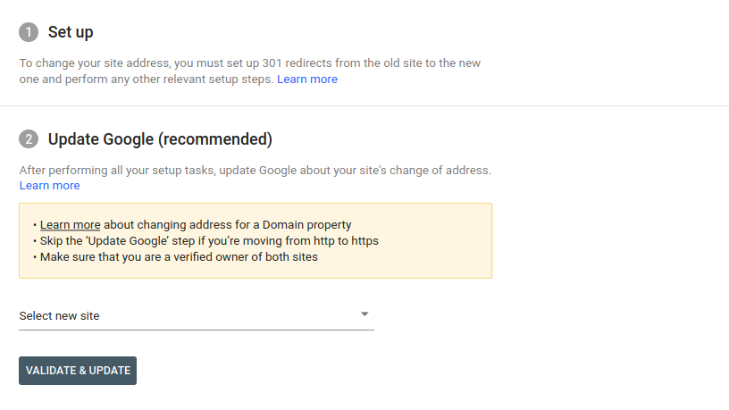
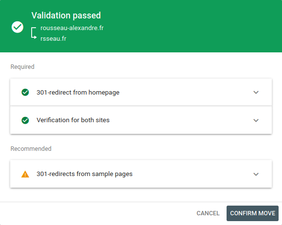
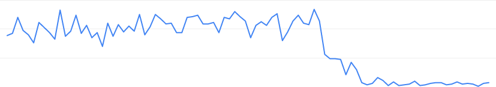
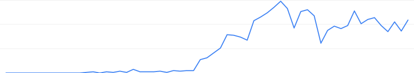

Recently I changed my website domain name from `rousseau-alexandre.fr` to `rsseau.fr`. This move was a little tricky because this may hurt your SEO if you miss something. So I think it may be a good idea to keep a document of what I did and share it. Maybe it can help you?

This tutorial tend to be generic and it may interesting you even if you host your website differently than me.

On this tutorial, my website is build with [Jekyll](https://jekyllrb.com/) and hosted on a Raspberry PI behind my ISP router. My RPI serve static files with a simple [Apache HTTP Server](https://httpd.apache.org/). This is really a simple stack.

Anyway in this post I will show you step I followed to make this move without hurting SEO. To follow this guide, you need to have basic knowledge of DNS, Apache configuration (if you use it) and Google Tools (if you use it too).

The main step will be :

1. Buy new domain
2. Setup new website
3. Create a redirection
4. Inform Google that you updated domain

Let's go.

## Before to make migration

Domains migration consist of **only change domain**. You should not migrate your domain **and** moving page URL at the same time. Website architecture should not change.

Also Google need some time to make domain change. So you should be sure to your new domain URL because you can't move again to a new one domain during a while.

## Buy domain name

This first step is to buy a brand new domain. To do so you can use any domain reseller. When it's done, put a DNS record type `A` to translate this domain to your server IP.

**Do no sell your previous domain name yet**. You must keep both domains during a time.

## Create new Apache configuration

After you bought you domain name and configure DNS you should update your Apache configuration _(I speak about Apache because it's what I use but the logic is same for Nginx)_.

In my case I just copy old configuration...

```bash
sudo cp /etc/apache2/sites-available/rousseau-alexandre.fr.conf /etc/apache2/sites-available/rsseau.fr.conf
```

... and replace `ServerName` and `ServerAlias` by new domain:

```bash
sudo sed -i 's/rousseau-alexandre.fr/rsseau.fr/g' /etc/apache2/sites-available/rsseau.fr.conf
```

Then activate the new configuration and restart server:

```bash
sudo a2ensite rsseau.fr.conf
sudo service apache2 restart
```

You may also want to create a new HTTPS certificate. Using [Let's Encrypt](https://letsencrypt.org/). If so, it's probably simply as `sudo certbot --apache` (it was for me).

## Update old Apache configuration

> if you are not concerned by server configuration, you can jump to next section

When you new Vhost is set on Apache, you may want to redirect all traffic from previous domain to new one.

You may ask yourself: "why not keep both website like this?". This may be simpler but this is not a good idea:

1. Google may detect duplicate content between theses two websites and penalize your new domain
2. You must make redirection to allow you to transfer Google property (next section)
3. You may want to keep track of your traffic into a single domain
4. This is really simple to make Apache redirection

I said "really simple"? Yes it is. With Apache `Redirect` directive. You just need to remove previous configuration and add `Redirect permanent` directive like this:

```diff
# /etc/apache2/sites-available/rousseau-alexandre.fr.conf
<VirtualHost *:80>
    ServerName rousseau-alexandre.fr
    ServerAlias www.rousseau-alexandre.fr
    ErrorLog ${APACHE_LOG_DIR}/rousseau-alexandre.fr.error.log
+    Redirect permanent / http://rsseau.fr
-    DocumentRoot /var/www/portfolio
-    <Directory /var/www/portfolio/ >
-       Options Indexes FollowSymLinks MultiViews
-       AllowOverride All
-       Order allow,deny
-       allow from all
-    </Directory>
</VirtualHost>
```

That's it.

Also do not forget to update HTTPS configuration if you have one:

```diff
# /etc/apache2/sites-available/rousseau-alexandre.fr-le-ssl.conf
<IfModule mod_ssl.c>
<VirtualHost *:443>
    ServerName rousseau-alexandre.fr
    ServerAlias www.rousseau-alexandre.fr
    ErrorLog ${APACHE_LOG_DIR}/rousseau-alexandre.fr.error.log
+    Redirect permanent / https://rsseau.fr/
-    DocumentRoot /var/www/portfolio
-    <Directory /var/www/portfolio/ >
-        Options Indexes FollowSymLinks MultiViews
-        AllowOverride All
-        Order allow,deny
-        allow from all
-    </Directory>

    Include /etc/letsencrypt/options-ssl-apache.conf
    SSLCertificateFile /etc/letsencrypt/live/www.rousseau-alexandre.fr/fullchain.pem
    SSLCertificateKeyFile /etc/letsencrypt/live/www.rousseau-alexandre.fr/privkey.pem
</VirtualHost>
</IfModule>
```

Then restart server:

```bash
sudo a2ensite rsseau.fr.conf
sudo service apache2 restart
```

## Update Your Website in Google Webmasters Tools

At this point you have :

- your website who works on new domain
- redirection from old domain to new one

It's time to inform Google that you change domain for your current site. This is really important because Google will understand that it's not duplicate content.

First you need to add a new property for your new domain. Google will verify that you own this domain by ask you to add a DNS property like this:

```
IN TXT "google-site-verification=XXXXX"
```

Then you simply need to go in [Google Webmaster settings](https://search.google.com/search-console/settings). There are a section to change domain of a property. Here you'll be able to select the new one.



I had to wait few hours to Google crawl redirection then I was able to submit form



That's it.

What happens now? Google will start to crawl your new website and begin to change result from your old website for the new one. **This process can take 180 days**.

## Delete previous domains

So now you think you can remove your old domain and stop your old website. I don't recommend it.

- you need to keep your old website at [least 180 days](https://support.google.com/webmasters/answer/9370220) because Google will continue to display search result for your old website
- back links we'll continue to link to your old website
- someone may want to buy your old domain to redirect visitor to his website. Or worse, use this domain to create some phishing attack.

So I my opinion you should keep this domains for

## And after some days

So let's connect on [Google Search Console](https://search.google.com/search-console) after few weeks and take a look at traffic evolution of previous domain :



Great! We see that traffic start to drop on migration date. So let take a look on traffic evolution of my new domain :



Theses informations show that all my traffic was correctly transferred into my new domain ! I get average same amount of clicks on my new domains than my old one. But it show also that even after some weeks, my old domain continue to receive traffic from Google.

## Link

- [Moving a Site to a New Domain - Apache Redirects/Rewrites](https://dev-notes.eu/2016/08/moving-a-site-to-a-new-domain/)
- [Outil de changement d'adresse - Aide Search Console](https://support.google.com/webmasters/answer/9370220)
- [How To Create Temporary and Permanent Redirects with Apache](https://www.digitalocean.com/community/tutorials/how-to-create-temporary-and-permanent-redirects-with-apache)
- [Change of Address Tool - Search Console Help](https://support.google.com/webmasters/answer/9370220)
