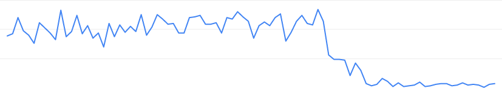

Récemment, j'ai changé le nom de domaine de mon site web de `rousseau-alexandre.fr` à `rsseau.fr`. Ce changement était un peu délicat car cela peut nuire au référencement du site. J'ai pensé que ce serait une bonne idée de conserver un document de ce que j'ai fait et de le partager. Peut-être que cela peut t'aider ?

Dans ce tutoriel, mon site web est construit avec [Jekyll](https://jekyllrb.com/) et hébergé sur un IP Raspberry derrière le routeur de mon FAI. Mon RPI sert des fichiers statiques avec un simple [serveur HTTP Apache](https://httpd.apache.org/). Ce tutoriel essaie d'être générique et il peut t'intéresser même si tu héberge ton site web d'un autre manière que la mienne.

Quoi qu'il en soit, dans cet article, je vais te montrer la démarche que j'ai suivie pour faire ce changement sans nuire au référencement. Pour suivre ce guide, tu dois avoir des connaissances de base sur le DNS, la configuration d'Apache (si tu l'utilise) et les outils Google (si tu les utilise aussi).

Les principales étape sont :

1. Acheter un nouveau domaine
2. Créer un nouveau site web
3. Créer une redirection
4. Informez Google que vous avez mis à jour le domaine

Allons-y.

## Avant la migration

La migration de domaines consiste à **changer de domaine uniquement**. Vous ne devez pas migrer votre domaine **et** déplacer l'URL de la page en même temps. L'architecture du site web ne doit pas changer.

Google a également besoin d'un certain temps pour effectuer le changement de domaine.

## Acheter un nom de domaine

Cette première étape consiste à acheter un tout nouveau domaine. Pour ce faire, tu peux faire appel à n'importe quel revendeur de domaines. Lorsque c'est fait, mettez un enregistrement DNS de type "A" pour traduire ce domaine à l'adresse IP de votre serveur.

**Attention à bien conserver ton ancien nom de domaine**. Tu dois posséder les deux domaines pendant un certain temps. J'en reparlerai plus loin dans l'article.

## Créer la nouvelle configuration Apache

Dans mon cas, ce site est un site statique construit avec [Jekyll](jekyllrb.com/). J'ai ensuite un serveur Apache qui définis plusieurs [_Virtual Host_](https://httpd.apache.org/docs/2.2/fr/vhosts/) pour servir plusieurs site (dont celui-ci). J'ai donc simplement crée un nouveau `VHost` à partir de l'ancien.

J'ai donc copié l'ancienne configuration vers une nouvelle

Dès que tu as reçu ton nouveau nom de domaine, tu dois le faire pointer sur ton nouveau site.

```bash
sudo cp /etc/apache2/sites-available/rousseau-alexandre.fr.conf /etc/apache2/sites-available/rsseau.fr.conf
```

... et remplacé le `ServerName` et `ServerAlias` par le nouveau:

```bash
sudo sed -i 's/rousseau-alexandre.fr/rsseau.fr/g' /etc/apache2/sites-available/rsseau.fr.conf
```

Et ensuite il suffit d'activer la nouvelle configuration.

```bash
sudo a2ensite rsseau.fr.conf
sudo service apache2 restart
```

A ce moment la, le nouveau site est disponible !

Tu peux aussi avoir besoin de reconfigurer le certificat HTTPS. Avec [Let's Encrypt](https://letsencrypt.org/) c'est aussi simple que de lancer la commande `sudo certbot --apache`.

## Mettre en place la redirection sur l'ancienne configuration Apache

Dès que le nouveau `Vhost` est mise en place et que le site fonctionne, tu as besoin de rediriger les page de ton ancien site vers le nouveau.

Tu te demandes sûrement: "Mais pourquoi je ne garderais pas les deux site en même temps". Effectivement ça serait plus simple mais ce n'est pas une bonne idée :

1. Google pourrait détecter un contenu dupliqué et pénaliser un voir les deux domaines
2. Google t'oblige à mettre en place la redirection (on le verra plus tard)
3. Tu as sans doute envie de suivre le traffic de ton site sans te prendre la tête a additionner les deux site à chaque fois
4. C'est vraiment très facile à mettre en place

J'ai dis "vraiment simple" ? Et bien oui ! Avec la directive Apache `Redirect`. Tu as juste besoin de supprimer certaines directive et de les remplacer par `Redirect permanent` :

```diff
# /etc/apache2/sites-available/rousseau-alexandre.fr.conf
<VirtualHost *:80>
    ServerName rousseau-alexandre.fr
    ServerAlias www.rousseau-alexandre.fr
    ErrorLog ${APACHE_LOG_DIR}/rousseau-alexandre.fr.error.log
+    Redirect permanent / http://rsseau.fr
-    DocumentRoot /var/www/portfolio
-    <Directory /var/www/portfolio/ >
-       Options Indexes FollowSymLinks MultiViews
-       AllowOverride All
-       Order allow,deny
-       allow from all
-    </Directory>
</VirtualHost>
```

Et c'est tout! N'oublie pas de mettre aussi la configuration pour la versions HTTPS

```diff
# /etc/apache2/sites-available/rousseau-alexandre.fr-le-ssl.conf
<IfModule mod_ssl.c>
<VirtualHost *:443>
    ServerName rousseau-alexandre.fr
    ServerAlias www.rousseau-alexandre.fr
    ErrorLog ${APACHE_LOG_DIR}/rousseau-alexandre.fr.error.log
+    Redirect permanent / https://rsseau.fr/
-    DocumentRoot /var/www/portfolio
-    <Directory /var/www/portfolio/ >
-        Options Indexes FollowSymLinks MultiViews
-        AllowOverride All
-        Order allow,deny
-        allow from all
-    </Directory>

    Include /etc/letsencrypt/options-ssl-apache.conf
    SSLCertificateFile /etc/letsencrypt/live/www.rousseau-alexandre.fr/fullchain.pem
    SSLCertificateKeyFile /etc/letsencrypt/live/www.rousseau-alexandre.fr/privkey.pem
</VirtualHost>
</IfModule>
```

Et ensuite on redémarre le serveur.

```bash
sudo a2ensite rsseau.fr.conf
sudo service apache2 restart
```

## Configurer Google Webmasters Tools

A ce moment tu as :

- un site qui fonctionne sur ton nouveau domaine
- la redirection qui fonctionne pour rediriger vers le nouveau site

Il est donc temps d'informer Google que tu as changé de nom de domaine. C'est vraiment important car tu vas aider Google à comprendre ce qui vient de ce passer.

Tu dois commencer par ajouter ton site dans le propriétés de ton compte Google Webmaster Tool. Il y a plusieurs options et pour ma part j'ai choisis d'entrer une nouvelle propriété DNS comme la suivante:

```
IN TXT "google-site-verification=XXXXX"
```

Ensuite tu n'as plus qu'à te rendre dans [les paramètres Google Webmaster](https://search.google.com/search-console/settings). Il y a une section _change domain of a property_ et la tu verra apparaître le nouveau nom de domaine.


J'ai eu besoin d'attendre quelques heures afin que Google scanne mon nouveau site et j'ai pu envoyer le formulaire.


Et c'est tout.

Que se passe-t-il maintenant ? Google va commencer à explorer ton nouveau site web et à modifier les résultats de recherche vers ton nouveau site. **Ce processus peut prendre 180 jours**.

## Supprimer les domaines précédents

Tu penses donc maintenant pouvoir supprimer ton ancien domaine et arrêter ton ancien site web. Je te le déconseille car :

- comme je l'ai dit plus haut, Google a besoin de [6 mois pour effectuer le transfert](https://support.google.com/webmasters/answer/9370220) et il continuera à afficher des résultats de recherche vers ton ancien site web
- certains _backlink_ continuerons de pointer vers ton ancien site
- quelqu'un peut vouloir acheter ton ancien nom de domaine pour rediriger les visiteurs vers un autre site. Pire, il peut utiliser ce domaine pour créer une attaque de phishing.

Je pense donc que tu dois conserver ce nom de domaine. Pendant combien de temps ? Je n'ai pas la réponse mais je pense le plus longtemps possible.

## Et après quelques semaines

Connectes toi donc sur [Google Search Console](https://search.google.com/search-console) après quelques semaines et regardez l'évolution du trafic du domaine précédent :



Super ! Tu vois que le trafic commence à diminuer à la date de la migration. Voyons donc l'évolution du trafic du nouveau domaine :


Ces informations montrent que tout mon trafic a été correctement transféré dans mon nouveau domaine ! Je reçois en moyenne le même nombre de clics sur mon nouveau site que sur l'ancien. Mais ces capture d'écran montrent aussi que même après quelques semaines, mon ancien site continue à recevoir du trafic de Google.

## Link

- [Moving a Site to a New Domain - Apache Redirects/Rewrites](https://dev-notes.eu/2016/08/moving-a-site-to-a-new-domain/)
- [Outil de changement d'adresse - Aide Search Console](https://support.google.com/webmasters/answer/9370220)
- [How To Create Temporary and Permanent Redirects with Apache](https://www.digitalocean.com/community/tutorials/how-to-create-temporary-and-permanent-redirects-with-apache)
- [Change of Address Tool - Search Console Help](https://support.google.com/webmasters/answer/9370220)
