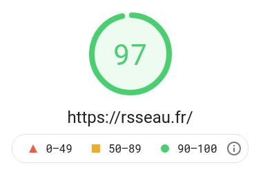

Je viens tout juste de migrer mon site qui utilisait [Jekyll](https://jekyllrb.com/) vers [Gatsby](https://www.gatsbyjs.com/). Dans cet article je vais essayer de faire le bilan de cette migration:

- pourquoi j'ai fais ce choix?
- comment j'ai pu réaliser cette migration?
- quels on été les bénéfices?

**TLDR**: Gatsby est un outil avec une courbe d'apprentissage bien plus longue que Jekyll. Il ne fait pas tout _out of the box_ mais c'est un plaisir de développer avec cet outil. Si tu souhaite faire un site et _basta_, il vaut mieux se tourner vers Jekyll. Si tu veux travailler avec un écosystème moderne, alors Gatsby est un meilleur choix.

## Un site statique

Pour mon site j'ai fais le choix d'utiliser un outil de générateur de site statique.

Si tu ne connais pas le principe, un générateur de site statique consiste à générer un site sous forme de fichier HTML / CSS / JavaScript lors d'**une étape de compilation**[^1]. Une fois que c'est fait, le site peut fonctionner sans interprétation côté serveur. En d'autre terme, plus besoins de PHP, Ruby ou autre. Il suffira juste déplacer les fichiers sur ton serveur web statique.

[^1]: le terme "compilation" n'est pas tout à fait exacte. L'étape de _build_ est en fait une **transpilation** puisqu'on n'obtient pas un binaire mais du HTML/CCS/JS. Afin de vulgariser, je préfère parler de **compilation**.

Les sites statiques te proposent souvent de rédiger le contenu sous forme de [Markdown](https://www.markdownguide.org/cheat-sheet/) qui est un langage de balisage très accessible.

Un site statique possède beaucoup d'avantages. **L'avantage principal est qu'il n'y a pas de base de données ni de langage interprété côté serveur**. Donc

1. **La sécurité est renforcée**. La plupart des failles de sécurité reposent sur le langage interprété côté serveur.
2. **Le coût du serveur est réduit**. J'utilise un simple [VPS chez OVH](https://www.ovhcloud.com/fr/vps/) à 3€/mois qui héberge aussi d'autres sites statiques. Et avant de passer chez OVH, j’utilisai [un Raspberry PI branché à ma box SFR](2017-10-11-installer-bridge-sfr-box-4k)
3. **Les performances sont excellentes** car le serveur n'a pas besoin d’interpréter un langage ni de faire des requêtes en base de données.
4. **Le positionnement dans les moteurs de recherche est amélioré**, car il dépend directement de la performance du site et notamment du temps de réponse

Je peux te prouver le résultat avec cette commande cURL qui montre le temps de réponse de mon site comparé à [wordpress.com](https://wordpress.com/) (qui est site fonctionnant avec un CMS et une base de données):

```bash
curl -w %{time_total} -s -o /dev/null https://rsseau.fr      # 0.010383
curl -w %{time_total} -s -o /dev/null https://wordpress.com/ # 0.467470
```

On voit donc que mon site répond en 10ms alors que Wordpress en presque une demie seconde. Donc un site statique répond **45 fois plus vite qu'un CMS classique** [^2].

[^2]: mon test n'est vraiment pas poussé car il faudrait bombarder de plusieurs requêtes et lisser les résultats.

Cette performance se retranscrit très bien avec le résultat de [l'outil PageSpeed de Google](https://developers.google.com/speed/pagespeed/insights/?url=https%3A%2F%2Frsseau.fr) qui parlent d'eux même:



Bref, si ton contenu n'est pas voué a évoluer tous les jours et que tu à la possibilité de l'écrire dans un générateur de site statique est la solution.

## Jekyll

Étant un fan du langage Ruby, j'avais initialement choisis [Jekyll](https://jekyllrb.com/) pour générer mon site. Jekyll est un des outils les plus populaire pour générer un site statique rapidement. C'est d’ailleurs l'outil utilisé pour [Github Pages](https://guides.github.com/features/pages/). C'est un outil que je recommande pour débuter car il est très facile à prendre en mains, même sans connaissance du langage Ruby.

### Mais...

Je me suis fixé comme objectif de monter en compétence sur **le design**. J'ai donc décider de refaire complètement le design de mon site. J'ai très vite rencontré des difficultés.

Je suis habitué aux **frameworks frontend**. Je ne sais donc plus faire du HTML/CSS "à l'ancienne". Je me suis habitué à l'architecture par composants. La philosophie de Jekyll à utiliser du HTML/CSS natif me ralentissais. Aussi, je travaille majoritairement avec l'écosystème JavaScript. **Je n'aime pas écrire du JavaScript "à l'ancienne"** (a.k.a `document.querySelector` et autres joyeusetés). C'est totalement objectif mais je voulais me tourner vers une façon de faire moderne.

Mon second point est que **Jekyll devient plus compliqué lorsqu'on souhaite sortir des clous**. Voici par exemple quelques fonctionnalités qu'il m'était compliqué de développer:

- intégrer une recherche rapide des articles
- gérer correctement l'internationalisation
- ajouter une section "articles liées" qui trouve automatiquement les articles ressemblant à celui affiché par l'utilisateur

Mon troisième point, est que je cherchais à m’expérimenter sur de nouvelles technologies. Si tu es développeur, tu sais tout comme moi que le web bouge et très vite. Les technologies d'il y a quelques années ne sont pas obsolète.

Pour conclure, **Jekyll faisait très bien le travail** et reste un outil très adapté. Il ne **me** correspondais juste plus.

## Quel générateur de site statique choisir?

Il existe plus de [300 générateur de site statique](https://jamstack.org/generators/). Il est très difficile de s'y retrouver. Le choix dépend essentiellement de

1. tes affinités sur un langage ou un framework en particulier
2. la complexité du site que tu cherches à développer
3. la taille de ton site. Certains outils sont plus adapté au très gros sites.

Je travaille beaucoup avec l'écosystème JavaScript et **j'ai donc choisis Gatsby!**.

Gatsby est est un outil reposant sur [React](https://fr.reactjs.org/). En plus de React, il intègre une surcouche qui va optimiser les performances et intégrer des outils pour construire ton site statique. Au lieu de te décrire ce qu'est Gatsby, laisse moi te montrer pourquoi je l'ai choisis.

### Utiliser du JavaScript moderne sans générer une application web lourde

A l'heure du [Green IT](https://www.google.com/url?q=https://en.m.wikipedia.org/wiki/Green_computing), on entend beaucoup parler d'**éco-conception de site**. Cela consiste à limiter les ressources côté serveur et côté client nécessaire à notre site. C'était un critère important pour moi car je souhaite de faire mon maximum pour que mon site soit efficient [^3]

Les frameworks web-moderne comme React, Vue.js ou Angular sont de superbes outils pour des applications web mais ils peuvent générer des sites nécessitant de télécharger et d’exécuter **plusieurs méga-octets de JavaScript**. Je trouve que c'est un non-sens pour un simple blog. Les librairies qu'on charge sur un site représentent une grande quantité de données.


[^3]: C'est d’ailleurs une des raison pour laquelle j'ai choisis de ne pas intégrer de module de tracking et que je [m'appuie sur les logs](./2019-11-07-lire-les-logs-avec-go-access.md) pour analyser les pages les plus consultées.

Gatsby répond parfaitement à cela car il effectue tout un tas d'optimisations par défaut:

1. il s'appuie sur [Webpack](https://webpack.js.org/) pour [morceler le code](https://webpack.js.org/guides/code-splitting/) en petits fichiers qui ne seront téléchargées que lorsque c'est nécessaire
2. le code est transpilé lors de l'étape de compilation, ainsi le site fonctionne même si l'utilisateur à désactivé JavaScript
3. et [bien d'autres](https://www.gatsbyjs.com/guides/why-are-gatsby-sites-fast/)

### SEO friendly

Google indexes les pages webs avec son robot qui parcourt le web de liens en liens. Vu la quantité de ressources que cela nécessite, Google définit un budget d'indexation par site et prend plus de temps à indexer un site nécessitant JS.

Les frameworks JavaScript modernes pâtissent de ce problème car sans JavaScript, le contenu HTML ne peut pas être construit. Voici un exemple avec Twitter:


Il y a plusieurs manière de contourner ce problème mais c'est très souvent compliqué à mettre en place.

La bonne nouvelle c'est que Gatsby le fait tout pour nous! Vu que React est exécuté sur notre ordinateur durant l'étape de compilation, le HTML est visible sans JavaScript.

### Hackable

Gatsby propose [tout un tas de plugins](https://www.gatsbyjs.com/plugins) (2824 à l'heure ou j'écris cet article). Ton besoin a déjà été codé par quelqu'un. Imaginons par exemple que tu souhaite:

- Utiliser les données d'un CMS existant pour créer tes articles? [gatsby-source-wordpress](https://www.gatsbyjs.com/plugins/gatsby-source-wordpress) / [gatsby-source-drupal](https://www.gatsbyjs.com/plugins/gatsby-source-drupal)
- Utiliser les données d'Airtable pour créer tes articles? [gatsby-source-airtable](https://www.gatsbyjs.com/plugins/gatsby-source-airtable)
- Utiliser les données de ton site de e-commerce? [gatsby-source-shopify](https://www.gatsbyjs.com/plugins/gatsby-source-shopify)
- Générer un Sitemap? [gatsby-plugin-sitemap](https://www.gatsbyjs.com/plugins/gatsby-plugin-sitemap)
- Implémenter une recherche rapide poussée? [gatsby-plugin-algolia](https://www.gatsbyjs.com/plugins/gatsby-plugin-algolia)

Si tu souhaites créer ton propre plugin, la [documentation est là](https://www.gatsbyjs.com/docs/creating-plugins/).

## Comment migrer depuis Jekyll

J'ai développé de zéro le site avec Gatsby afin de le prendre en main. Cela a été le plus gros du travail. Néanmoins, Il est possible d'utiliser [un modèle prêt à l’emploi de blog pour Gatsby](https://www.gatsbyjs.com/starters/gatsbyjs/gatsby-starter-blog/). Cela évite la partie développement pur.

Ensuite, concernant la migration du contenu est très facile car Jekyll et Gatsby s'appuient sur le Markdown. Il suffit donc de déplacer les articles et de les retoucher un peu. Dans mon cas j'ai eu besoin:

- d'uniformiser l'en-tête _frontmater_ des fichiers Markdown. Tous les articles doivent comporter les mêmes clés comme `date`, `title`, etc...
- les liens entre les posts peuvent changer. Gatsby utilise des liens relatifs comme `[title](./other-post)`
- les URL des images peuvent changer aussi. Dans mon cas j'ai crée un dossier `content/posts/images` et j'utilise ses images en faisant ``

## Gérer la transition pour le SEO

Il est important de prendre en compte le SEO lorsqu'on change l'architecture d'un site [^4]. Dans mon cas j'avais plusieurs choses à faire:

[^4]: J'ai fait le choix de changer les URL de mes articles mais il est possible de reproduire la même architecture en pimpant `gatsby-node.js`.

1. rediriger les pages ayant changés d'URL avec un statut HTTP `301 - redirect permanent`
2. indiquer les pages ayant disparues avec un statut HTTP `410 - Gone`

Pour envoyer ces statuts, il est possible d'utiliser un fichier `.htaccess` avec Apache.

J'ai donc commencé par [exporter mes pages indexées via Google Search Console](https://search.google.com/search-console/performance/search-analytics?resource_id=sc-domain%3Arsseau.fr&breakdown=page) et j'ai fait le mapping dans le fichier `.htaccess`. En voici un extrait.

```htaccess
Redirect permanent /benchmarking/2018/11/12/benchmark-templates.html /2018-11-12-benchmark-templates
Redirect permanent /blog/page/2/ /blog
Redirect gone /books/api_on_rails_5-en.html
```

Afin de mettre en place le fichier `.htaccess`, j'ai choisis d'utiliser le plugin [`gatsby-plugin-htaccess`](https://www.gatsbyjs.com/plugins/gatsby-plugin-htaccess/). que j'ai configuré rapidement comme ceci

```js
// gatsby-config.js
module.exports = {
  // ..
  plugins: [
    // ...
    {
      resolve: "gatsby-plugin-htaccess",
      options: {
        custom: `
            Redirect permanent /benchmarking/2018/11/12/benchmark-templates.html /2018-11-12-benchmark-templates
            Redirect permanent /blog/page/2/ /blog
            Redirect gone /books/api_on_rails_5-en.html
            ...
        `,
      },
    },
  ],
};
```

Il faut s'assurer que la configuration apache autorise le `.htaccess` et ensuite on peut tester la redirection avec cURL

```bash
curl https://rsseau.fr/blog/page/2/
```

```html
<!DOCTYPE html PUBLIC "-//IETF//DTD HTML 2.0//EN">
<html>
  <head>
    <title>301 Moved Permanently</title>
  </head>
  <body>
    <h1>Moved Permanently</h1>
    <p>The document has moved <a href="https://rsseau.fr/blog">here</a>.</p>
  </body>
</html>
```

Et le tour est joué!

## Conclusion

Les générateurs de site statiques sont de formidables outils. Gatsby pousse le site statique bien plus loin en donnant la possibilité d'alimenter le contenu avec des données extérieurs (Wordpress, Airtable, etc..) alors que Jekyll permet simplement d'utiliser du Markdown.

Dans mon cas, n'utilisant que du Markdown, **la migration de Jekyll à Gatsby n'était pas nécessaire**. Si tu utilise aussi Jekyll et que cela te conviens, reste avec Jekyll. Dans mon cas, la motivation de cette migration était vraiment motivée par apprendre de nouveaux outils.

Développer avec Gatsby ma demandé beaucoup d'efforts car **c'est un outils beaucoup plus complexe**. En revanche, je ne regrette pas le temps que j'y ait investi. Je me servirai très certainement de cet outils lors d'un futur projet.

Gatsby m'a aussi offert la possibilité d'utiliser des technologies modernes tout en me donnant les performances que j'attendais. Ça a été vraiment plaisant de pouvoir utiliser React au seins de mon petit projet!

Aujourd'hui j'ai mon propre système que je peut faire évoluer comme je le souhaite. Je pourrais très bien faire évoluer mon site comme un [_digital garden_](https://www.dschapman.com/articles/using-dendron-and-gatsby-together) par exemple.
