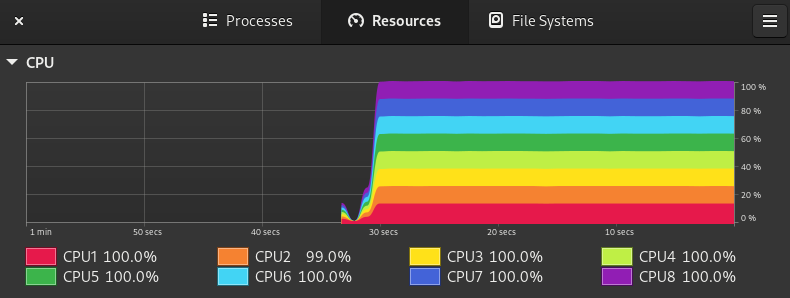

Recently, I tried to create a quick Bash script to convert my big music library of lossless files (+4K FLAC files) to a lossy format (MP3).

Doing that is really easy using a tool like [ffmpeg](https://ffmpeg.org/). In fact, it's just one line of code:

```bash
ffmpeg -i 'music.flac' 'music.mp3'
```

And voilà.

Then, to do the job on the whole library, you just need a loop using `find`:

```bash
find . -type f -print0 | while read -r -d $'\0' FILE
do
  if [[ $FILE == *.wav ]] || [[ $FILE == *.flac ]] || [[ $FILE == *.alac ]]
  then
    # call ffmpeg here
  fi
done
```

## The script

OK Good, let's wrap everything into a script. We want to:

1. loop on every files
2. construct the new file path from the export directory taken as argument
3. call `ffmpeg` or copy the file as is if the format is already lossy (not `.ogg` or `.mp3`)

And there is:

```bash
# take args
EXPORT_DIR="$1"
FORMAT="${2:-ogg}"

if [ -z "$EXPORT_DIR" ]; then
  help
  echo "You must provide the export directory" 1>&2
  exit 1
fi

# create the export folder if not exists
mkdir -p "$EXPORT_DIR" 2> /dev/null

function get_out_directory() {
  music_directory=$(dirname "$1")
  path="$EXPORT_DIR/${music_directory/.}"
  mkdir -p "$path"
  echo "$path"
}

function convert_file() {
  path=$(get_out_directory "$1")
  filename="$(basename "$1")"
  new_file="$path/${filename%.*}.$2"

  if [ -f "$new_file" ]; then  return 0; fi

  ffmpeg -i "$1" "$new_file"
}

function copy_file() {
  path=$(get_out_directory "$1")
  new_file="$path/$(basename "$1")"

  if [ -f "$new_file" ]; then  return 0; fi

  cp "$1" "$new_file"
}

find . -type f -print0 | while read -r -d $'\0' FILE
do
  if [[ $FILE == *.wav ]] || [[ $FILE == *.flac ]] || [[ $FILE == *.alac ]]
  then
    convert_file "$FILE" "$FORMAT"
  else
    copy_file "$FILE"
  fi
done
```

If your not familiar with Bash, don't worry, you don't have to understand the whole logic.

The main issue here is the `convert_file` will call `ffmpeg` and takes some time. The whole script takes too much time because we convert file one by one and we don't use the whole ressources of the computer.

So you certainly think about implementing a threading mechanism and you think that Bash can't do that! You're wrong, we can use [GNU Parallel][gnu-par] really easily.

## Multithreading with GNU Parallel

> GNU parallel is a shell tool for executing jobs in parallel using one or more computers. A job can be a single command or a small script that has to be run for each of the lines in the input. The typical input is a list of files, a list of hosts, a list of users, a list of URLs, or a list of tables. A job can also be a command that reads from a pipe. GNU parallel can then split the input into blocks and pipe a block into each command in parallel. -- [doc](https://www.gnu.org/software/parallel/parallel.html#EXAMPLE:-Working-as-xargs--n1.-Argument-appending)

you can install easily

```sh
# Debian / Ubuntu
sudo apt install parallel
# Mac OS
brew install parallel
```

There is [many arguments](https://www.gnu.org/software/parallel/parallel.html#EXAMPLE:-Working-as-xargs--n1.-Argument-appending) but don't be afraid, we'll use it easily.

What I do is:

1. I create a text file and push my command in it
2. I run `parallel` command specifying the file

Easy, isn't it ?

## Improving the script

OK, let's try it on my current script:

```bash
JOBS_FILE=$(mktemp "$EXPORT_DIR/music-library-export.XXXXX")
echo "tasks created in $JOBS_FILE"

function convert_file() {
  path=$(get_out_directory "$1")
  filename="$(basename "$1")"
  new_file="$path/${filename%.*}.$2"

  echo "ffmpeg -i '$1' '$new_file'" >> "$JOBS_FILE"
}

function copy_file() {
  path=$(get_out_directory "$1")
  new_file="$path/$(basename "$1")"

  echo "cp '$1' '$new_file'" >> "$JOBS_FILE"
}

find . -type f -print0 | while read -r -d $'\0' FILE
do
  if [[ $FILE == *.wav ]] || [[ $FILE == *.flac ]] || [[ $FILE == *.alac ]]
  then
    convert_file "$FILE" "$FORMAT"
  else
    copy_file "$FILE"
  fi
done


parallel --bar < "$JOBS_FILE"
```

Running this script use the full ressource of my computer:



## Conclusion

I discovered this tool recently and it's a good to know one because we often think that Bash can't do the job of expensive script. This example demonstrates it can be done easily.

[ts-doc]: https://www.typescriptlang.org/docs/handbook/2/narrowing.html#using-type-predicates
[gnu-par]: https://www.gnu.org/software/parallel/
