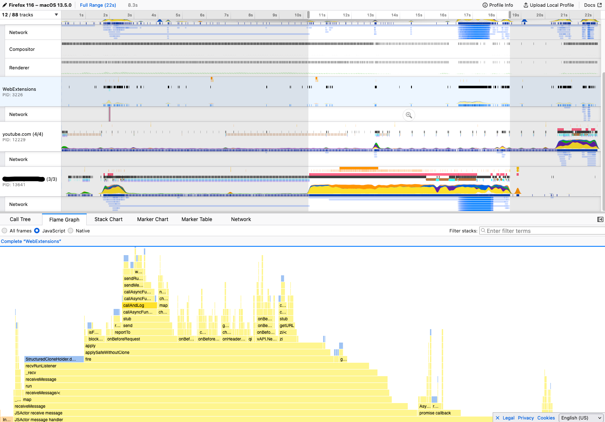
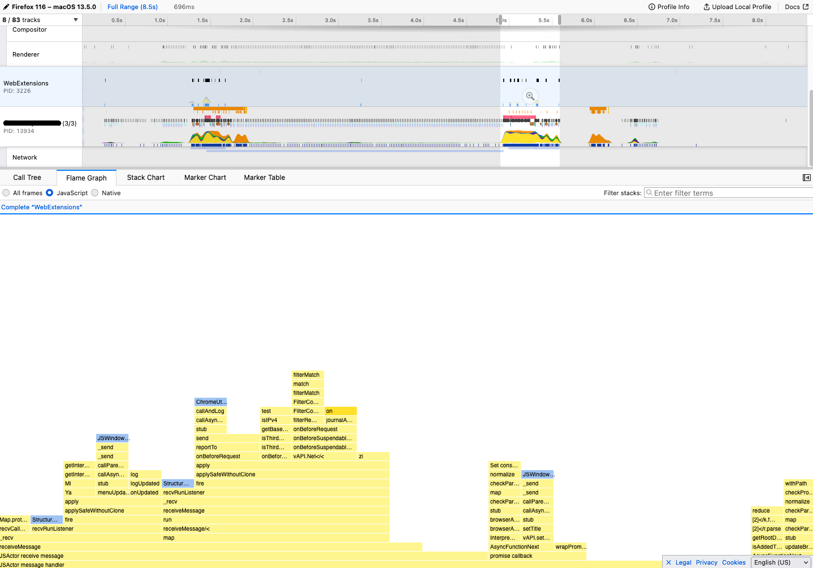

Recently, I got some performances issues on a frontend project because my application was loading more than hundred large components. Thus, during the loading of the page, the JavaScript main thread was locked and the UI was stuck during few seconds.

It's possible to detect that using the developper tools and start a performance test. Here is the result:



The take away from this flamgraph is the hilighted part. The horizontal red bar means that the JavaScript main thread is computing. It means the browser can't render anything meanwhile. In my example, we see it lasts ~6 seconds, which is a lot!

The issue was quite obvious, the loading imply to mutate a too big amount of the DOM and the browser had too much work to do.

There is some way to solve this. We could implement a pagination and load a different slice of the element to render: It's easy to implement but it degrades the UX because the user needs to click on the next page button.

So I searched a simple way to implement a scroll listener and load components once it's visible in the viewport.

## Intersection Observer

Hopefully, JavaScript covers our need using [`IntersectionObserver`](https://developer.mozilla.org/en-US/docs/Web/API/Intersection_Observer_API).

> The Intersection Observer API provides a way to asynchronously observe changes in the intersection of a target element with an ancestor element or with a top-level document's viewport. -- [MDN](https://developer.mozilla.org/en-US/docs/Web/API/Intersection_Observer_API)

The API is really simple, we just need to take care of closing the `IntersectionObserver` once we don't need it anymore:

```ts
const observer = new IntersectionObserver((entries) => {
  const visible = entries.some((element) => element.isIntersecting);
  if (!visible) return;
  observer.unobserve(element);
  // 🙌 The element is visible
});
observer.observe(element);
currentObserver.value = observer;
```

## Wrap everything into a component for VueJS

Now we have a way to observe the visibility of an element, let's wrap everything into a component.

NOTE: I'll use Vue.js for the example but it can be any frontend framework.

We'll create a component `LazyLoader` with two slots:

- `content`, the component to display
- `spinner`, a simple component responsible to "reserve" the space and/or display a pretty spinner

We'll display the right slot accoring to the visibility.

```vue
// src/components/LazyLoader.vue
<template>
  <div class="lazy-load" ref="container">
    <slot name="spinner" v-if="!isVisible" />
    <slot name="content" v-else />
  </div>
</template>
```

Now, we just need to use the composition API to:

1. get the `container`
2. introduce a ref `isVisible`
3. use the snippet bellow to toggle `isVisible`
4. makes sure to disconnect observer on unmout

Here is the result:

```ts
export default {
  name: "LazyLoader",
  setup() {
    const container = ref<Element>();
    const isVisible = ref(false);
    const currentObserver = ref<IntersectionObserver | undefined>();

    function observeVisibility(element: Element) {
      // close the old IntersectionObserver if exists
      currentObserver.value?.disconnect();

      const observer = new IntersectionObserver((entries) => {
        // check if any observed elements are visible
        const visible = entries.some((element) => element.isIntersecting);
        if (!visible) return;

        // the element is visible, we don't need the observer anymore
        observer.unobserve(element);
        isVisible.value = true;
      });

      // observe the element and save the observer to close it if necessary
      observer.observe(element);
      currentObserver.value = observer;
    }

    watch(
      container,
      () => {
        // handle if the browser doesn't support IntersectionObserver
        if (!window.IntersectionObserver) return (isVisible.value = true);
        // if HTML ref exists, start to observe visibility
        if (container.value) observeVisibility(container.value);
      },
      { immediate: true }
    );

    // be sure to close IntersectionObserver if component is destroyed
    onUnmounted(() => currentObserver.value?.disconnect());

    return { container, isVisible };
  },
};
```

Now we just need to use the component in the list

```vue
<template>
  <LazyLoader v-for="(item, index) of bigList" :key="index">
    <template v-slot:content>
      <Card :item="item" />
    </template>
    <template v-slot:spinner>
      <CardLoader />
    </template>
  </LazyLoader>
</template>
```

## Result

The implementation is really simple, it doesn't require any dependency and it's performant.

In my use case, it reduced the rendering time to 700mx (-90%).



I want to mention my example was with Vue.js but it can be adapted to other frontend framework.

Try it yourself:

<iframe src="https://stackblitz.com/edit/vue-k2dsze?embed=1&file=src%2FApp.vue" width="100%" height="500px"></ifram>
