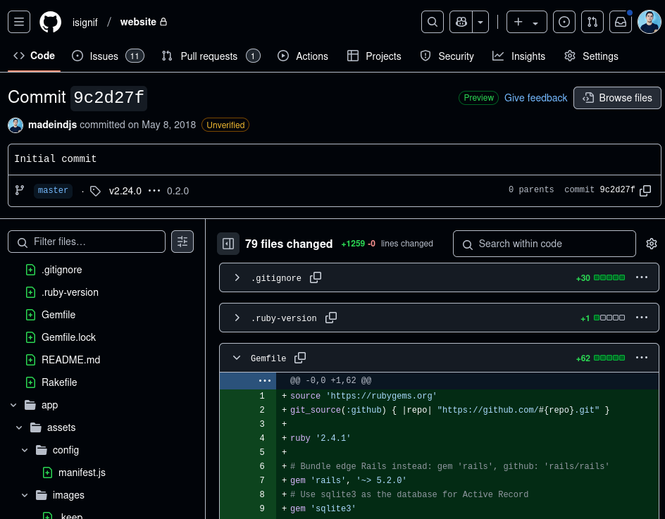
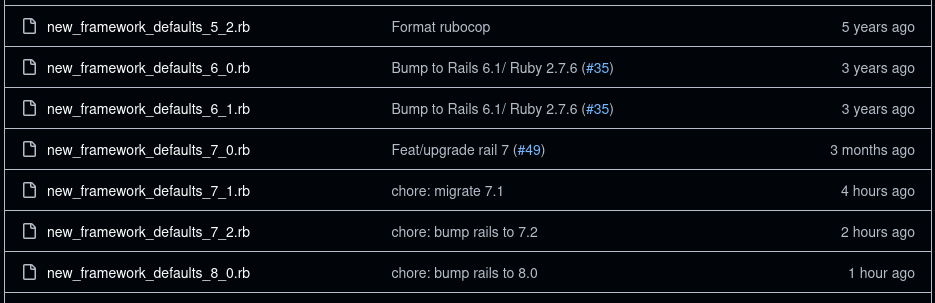
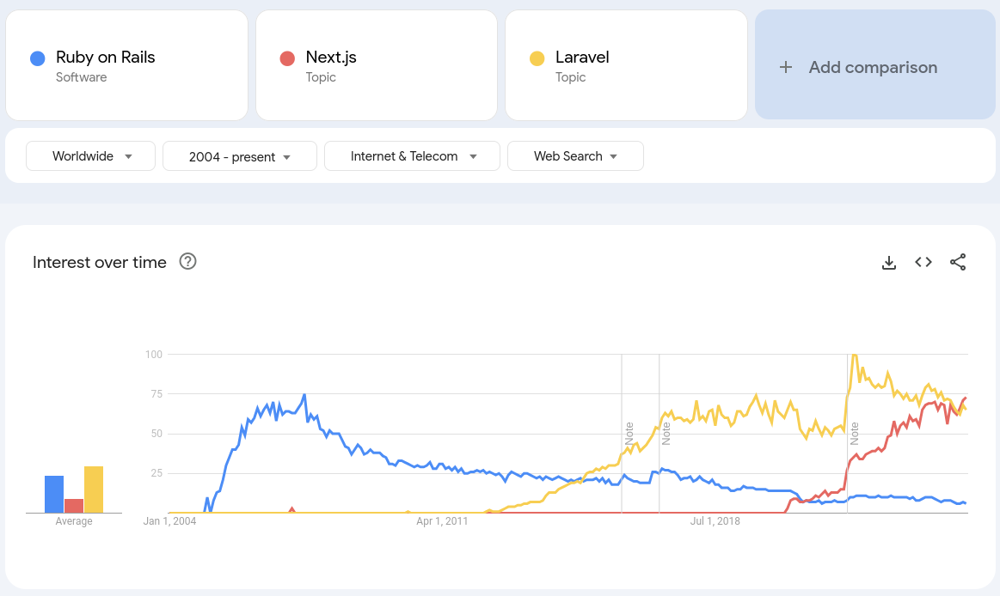

I started [iSignif](https://isignif.fr), almost 8 years ago. Initially, it was a cool SAAS project powered by one of the most trendy stack: [Ruby on Rails](https://rubyonrails.org/).

Almost 8 years later, I think my stack joined [the boring technology club](https://boringtechnology.club/), and I'm still happy to maintain this project!

## The framework

Back in the day, I initialized the project with Ruby on Rails 5 / Ruby 2.4.2. At that time, it was the latest version.

Rails amazes me about how easy it is to upgrade to major versions. I upgraded from `v5.x` to `v6.x`, then `7.x` and finally `v8.0` with ease. It was almost just by bumping the Rails version in the `Gemfile` and run `rails app:update` . The latter takes care of setting new default configuration parameters.

Compared to my experience with the newer stack in "Frontend world", it's a breeze:

1. I [remember give up](/fr/blog/go-back-to-jekyll) on upgrading [Gatsby](https://www.gatsbyjs.com/) for my personal website
2. I had a hard time with [Nest.js](https://nextjs.org/) and their new `app` directory on my side project <https://the-killer.online/>

Definitely, Ruby on Rails is not a popular choice nowadays. I don't see many posts about Rails applications on [Hacker news](https://news.ycombinator.com/), and we can confirm it using [Google trend](https://trends.google.com/trends/explore?cat=13&date=all&q=%2Fm%2F0505cl,%2Fg%2F11h4q9rcf3,%2Fm%2F0jwy148&hl=en) of Rails vs other popular choices:

**But I think that, when a project requires stability, a boring framework is a better choice.**.

I won't lie, it's difficult to resist the hype, and I thought many times about doing a big rewrite of the APP using a new technology like [Nuxt](https://nuxt.com/). And I'm still not happy to go back to plain HTML/ERB templating, but it does the job.

## The server

Back in the day, you just needed a Linux server to host your application. It was a job on its own though, but it's how I started inside the iSignif startup, where nobody else than me is comfortable in this area.

But then, the trend became to use a PAAS service like [Heroku](https://www.heroku.com/), that handles everything for you. Later, it became [Docker](https://docker.com/) / Kubernetes and a cloud provider like [Google Cloud](https://cloud.google.com/) to make it scalable.

I stayed on the same VPS server I ordered 8 years ago.

Powered by Ubuntu 18.04, it's really a simple Linux server with [Apache server with Phusion Passenger](/en/blog/deploy-rails). Again, it does the job done.

I discovered myself some admin system skills and:

- I upgraded my Server to Ubuntu 20 and then 22.
- ordered an additional hard drive and move assets on it
- did some Bash scripts for the backup running with cron
- automate some startup scripts with Systemd

But most importantly, it helped us to keep the hosting cost low. Actually, the server cost me around 10€/month. So it permitted us to host the service even when we had few revenues.

## My feeling

From my (small) experience, I found that launching a SAAS is a long run journey. Especially when you do it part-time.

I would probably earn a lot more money doing a freelance job instead of having spent these countless hours on this side project. But I learned a lot, probably more than if I worked as a developer.

Doing it helped me to forge my own opinion on the developer role. I now think that the main thing to keep in mind is to think about the startup goal, not the technology.

Will I restart a Ruby on Rails project today? Most likely not; there are countless mature and more exciting technologies nowadays. But I'm really proud of the journey I had with Ruby. I think I made the right choice 8 years ago.
