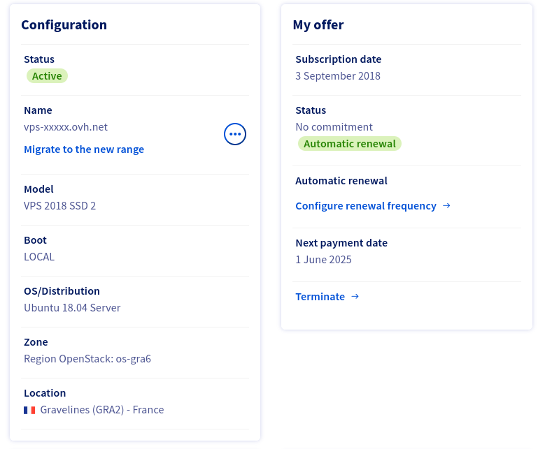

I started [iSignif](https://isignif.fr), almost 8 years ago. Initially, it was cool SAAS project powered by one of the most trendy stack: [Ruby on Rails](https://rubyonrails.org/).

Almost 8 years later, I think my stack joined [the boring technology club](https://boringtechnology.club/), and I'm still happy to maintain this project!

## The framework

Back in the days, I initialized the project with Ruby on Rails 5 / Ruby 2.4.2. At that time, it was the latest version.

Rails amaze me with the ease of bumping new major versions. I upgraded to `6.x`, `7.x` and now `8.0` with ease. It was almost just by bumping the Rails version in the `Gemfile` and run `rails app:update` which take care of settings new default configuration parameters.

It's not that easy in the Frontend world. I remember gave up on bumping [Gatsby](https://www.gatsbyjs.com/) for my personal website, or also had hard time with [Nest.js](https://nextjs.org/) and their new `app` directory.

### The hype

I'm still passionate about new ways of doing things. Nowadays, I can say that I don't see many posts about Rails application on [Hacker news](https://news.ycombinator.com/).

For instance, take a look at [this Google trend](https://trends.google.com/trends/explore?cat=13&date=all&q=%2Fm%2F0505cl,%2Fg%2F11h4q9rcf3,%2Fm%2F0jwy148&hl=en) of Rails vs other popular choice

I won't lie, it's hard to resist to the hype and I though many time about doing a big rewrite of the APP using a new technology like [Nuxt](https://nuxt.com/).

## The server

Back in the days, it was cool to use [Heroku](https://www.heroku.com/) to deploy a Rails application. Then it was better to migrate to [Docker](https://docker.com/) and deploy the image with Kubernetes to a cloud provider like [Google Cloud](https://cloud.google.com/).

I stayed on my cheap VPS server powered by Ubuntu 18.04. It's really a simple Linux server with [Apache server with Phusion Passenger](/en/blog/deploy-rails). I discovered myself some admin system skills and I upgraded my Server to Ubuntu 20 and then 22.

At that time, .

8 years later, the project is still running on that server.

**My cheap hosting allowed me to have low fees and continue to host my SAAS even if we don't have enough user paying for it.**

## My feeling

Having a side project is really the best way to forge your own opinion. I would probably earned a lot more money doing a freelance job instead of having spent these countless hours on this side project. But I learned a lot, probably more than if I worked on others SAAS companies.

Will I restart a Ruby on Rails project today? Probably not, but I'm really proud of the journey. I can affirm that I did the right choice.
