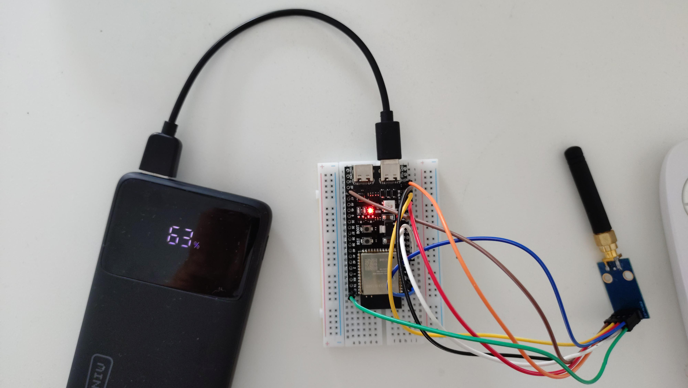
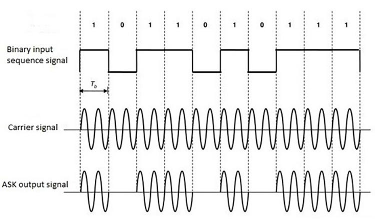
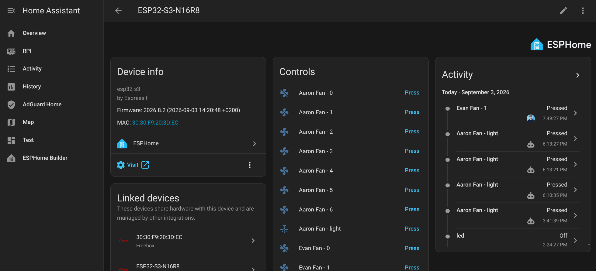
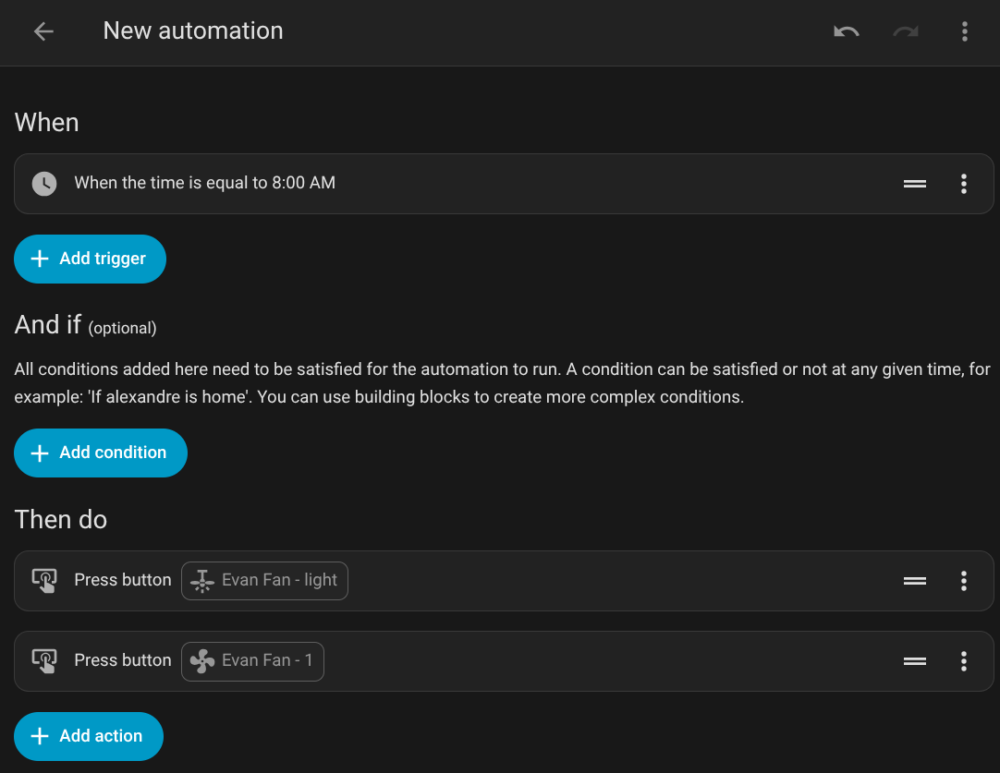

**TL;DR**: My ceiling fan remote is a dumb 433 MHz ASK/OOK transmitter, so I gave its signal a brain. Using an ESP32-S3, a CC1101 sub-GHz transceiver and ESPHome, I built a little gateway that **captures** the remote's frames and **replays** them — the fan and its light are now first-class Home Assistant entities, drivable from buttons, automations and voice assistants, with no vendor cloud involved. This post walks through the hardware, the YAML configuration, and the gotchas (half-duplex radio, SPI pin assignment), with [Hermes](https://hermes-agent.nousresearch.com/) acting as my AI guide along the way.



## Context

Recently, I discovered Home Assistant and started falling down the rabbit hole of home automation. A few connected light bulbs later, I wanted to go further. My main pain point was finding the remote of my ceiling fan: most of the time I had to search everywhere just to switch on the light in the room. Surely Home Assistant could handle that!

Most ceiling fans are controlled through a handheld RF (_Radio-Frequency_) remote on **433.92 MHz, ASK/OOK modulation**. This means the remote sends a signal, and the receiver catches the sequence and executes an action.



So we just have to capture the signal, and replay it. Which means we need a receiver/emitter.

There are some products that do exactly this:

1. **BroadLink RM4 / Tuya RF bridges** — work, but are closed black boxes that depend on a vendor cloud.
2. **Sonoff RF Bridge** — flashable with ESPHome, but limited to a single protocol and only 433 MHz ASK/OOK.
3. **A dedicated 433 MHz transceiver on an ESP32** — the route taken here, using a **CC1101** sub-GHz radio module. It is cheap, well documented, and fully supported by ESPHome through the [`cc1101`](https://esphome.io/components/cc1101/) component.

So I chose the last option. It was my entrypoint to the ESPHome world.

One thing worth knowing upfront: RF hardware and embedded development were brand-new territories for me. I went through this whole project with [Hermes](https://hermes-agent.nousresearch.com/) — an AI agent from [Nous Research](https://nousresearch.com/) — acting as my guide: understanding ASK/OOK modulation, choosing the radio module, writing and debugging the ESPHome configuration. Honestly, I couldn't have done it without AI acting as a support for this project.

## ESPHome

[ESPHome](https://esphome.io/) is a firmware framework that lets you describe an ESP32 board in a single YAML file: which pins are connected to which sensors, which entities should be exposed, and so on. It compiles that description into a firmware image, and the device connects to Home Assistant automatically — no cloud, no vendor app. Changing the configuration is just a YAML edit followed by an over-the-air update.

The CC1101 is interesting because it is a _real_ transceiver (TX _and_ RX) tunable from 300 to 928 MHz, with configurable modulation and output power. Unlike a cheap 433 MHz super-regenerative transmitter, it can both **capture** the remote's frames and **replay** them.

## Hardware

### The CC1101 module

An 8-pin breakout board
([Amazon link](https://www.amazon.fr/ICQUANZX-Module-CC1101-%C3%A9metteur-r%C3%A9cepteur-antenne/dp/B07YX92NMP))
exposing:

| Pin | Name      | Direction | Role                                |
| --- | --------- | --------- | ----------------------------------- |
| 1   | GND       | -         | Ground                              |
| 2   | VCC       | in        | Power, **1.8–3.6 V** (use 3.3 V)    |
| 3   | GDO0      | out       | General-purpose digital output (TX) |
| 4   | CSN       | in        | SPI chip select                     |
| 5   | SCK       | in        | SPI clock                           |
| 6   | MOSI      | in        | SPI data in                         |
| 7   | MISO/GDO1 | out       | SPI data out                        |
| 8   | GDO2      | out       | Second digital output (used for RX) |

### The ESP32-S3 board

An `ESP32-S3-N16R8` (16 MB flash, 8 MB PSRAM). The ESP32-S3 has a
flexible GPIO matrix, but a few pins have special roles worth knowing
about:

- **GPIO0** is the BOOT/strapping pin.
- **GPIO19/GPIO20** are USB D-/D+.
- **GPIO11/GPIO12/GPIO13/GPIO10** are the hardware FSPI pins
  (`FSPID` / `FSPICLK` / `FSPIQ` / `FSPICS0`) — ideal for driving the
  CC1101 over IOMUX at full SPI speed.

### Wiring

| CC1101 Pin | ESP32-S3 GPIO | Function    |
| ---------- | ------------- | ----------- |
| 1 (GND)    | GND           | Ground      |
| 2 (VCC)    | 3V3           | Power       |
| 3 (GDO0)   | GPIO7         | TX data out |
| 4 (CSN)    | GPIO10        | SPI CS0     |
| 5 (SCK)    | GPIO12        | SPI clock   |
| 6 (MOSI)   | GPIO11        | SPI MOSI    |
| 7 (MISO)   | GPIO13        | SPI MISO    |
| 8 (GDO2)   | GPIO21        | RX data out |

## The ESPHome configuration

ESPHome ships a
[`cc1101`](https://esphome.io/components/cc1101/) component that wraps
the radio, plus the classic `remote_transmitter` / `remote_receiver`
components that implement the actual 433 MHz protocol stack on top of
it. Let's build the configuration step by step.

### Step 1: board and radio

First the boilerplate: the board, Wi-Fi, and the `cc1101` hub itself
(talking over SPI). The `on_boot` trigger puts the radio in RX mode
right away so we can start capturing immediately:

```yaml
# Board: Generic ESP32-S3 Board (Generic)
esphome:
  name: esp32-s3-n16r8
  friendly_name: ESP32-S3-N16R8
  on_boot:
    then:
      - cc1101.begin_rx

esp32:
  variant: esp32s3
  framework:
    type: esp-idf

logger:

api:
  encryption:
    key: ...

ota:
  - platform: esphome
    password: !secret esp32_s3_n16r8__ota_password

wifi:
  ssid: !secret wifi_ssid
  password: !secret wifi_password

captive_portal:

spi:
  interface: hardware # IOMUX, full SPI speed
  clk_pin: GPIO12 # SCK  → CC1101 Pin 5  (FSPICLK)
  mosi_pin: GPIO11 # MOSI → CC1101 Pin 6  (FSPID)
  miso_pin: GPIO13 # MISO → CC1101 Pin 7  (FSPIQ)

cc1101:
  cs_pin: GPIO10 # CSN → CC1101 Pin 4 (FSPICS0)
  frequency: 433.92MHz
  output_power: 10
  modulation_type: ASK/OOK
  symbol_rate: 5000
  filter_bandwidth: 200kHz
```

### Step 2: the receiver

Now the `remote_receiver` component. It listens on GDO2 and dumps every
captured frame as a list of pulse durations. The default dumpers try
to "decode" raw pulses against every known protocol — see the trap
below — so we restrict `dump:` to `raw`.

The `on_raw` trigger does two jobs: it logs the pulses in small chunks
(so each line fits in the ESPHome log buffer and can be copy-pasted
from the logs), and it stores the last burst in a global when learning
mode is on:

```yaml
# Global to store the learned signal
globals:
  - id: learned_code
    type: std::vector<int32_t>
    restore_value: no
  - id: learning_mode
    type: bool
    initial_value: "false"
  - id: signal_learned
    type: bool
    initial_value: "false"

# RF receiver (via GDO2)
remote_receiver:
  id: rf_receiver
  pin: GPIO21
  tolerance: 50%
  filter: 200us
  dump:
    - raw
  idle: 10ms
  on_raw:
    then:
      - lambda: |-
          // Log in chunks so each line fits the ESPHome log buffer (~256 chars).
          // Reassemble: part0 + ", " + part1 + ", " + ... -> code: [...]
          ESP_LOGI("raw_code", "Pulses: %d", x.size());
          const int chunk = 40;
          for (int i = 0; i < (int)x.size(); i += chunk) {
            std::string s;
            for (int j = i; j < (int)x.size() && j < i + chunk; j++) {
              if (j > i) s += ", ";
              s += std::to_string(x[j]);
            }
            ESP_LOGI("raw_code", "part %d: %s", i / chunk, s.c_str());
          }

          // Learning mode: store this burst and stop listening
          if (id(learning_mode)) {
            id(learned_code).clear();
            for (int32_t val : x) {
              id(learned_code).push_back(val);
            }
            id(signal_learned) = true;
            id(learning_mode) = false;

            std::string preview = "";
            int count = 0;
            for (int32_t val : id(learned_code)) {
              if (count > 0) preview += ", ";
              preview += std::to_string(val);
              count++;
              if (count >= 20) {
                preview += "... (" + std::to_string(id(learned_code).size()) + " total)";
                break;
              }
            }

            id(last_signal).publish_state(preview.c_str());
            id(learn_status).publish_state("Signal learned! " + std::to_string(id(learned_code).size()) + " pulses.");
          }
```

---

> **Trap for new players:** the IR dumpers (`pronto`, `nec`, `beo4`…)
> will happily try to "decode" 433 MHz RF frames and produce garbage
> like Pronto frequency `006D` (= 38 kHz IR). Restricting `dump:` to RF
> protocols avoids pages of false positives in the logs.

### Step 3: the transmitter

The transmitter is connected to GDO0. The subtlety is that the CC1101
is a **half-duplex** radio: it can be in RX mode _or_ TX mode, never
both. The `on_transmit` / `on_complete` automations of
`remote_transmitter` handle the switching: enter TX mode just before
sending, and go back to RX mode right after:

```yaml
# RF transmitter (via GDO0)
remote_transmitter:
  id: rf_transmitter
  pin: GPIO7
  carrier_duty_percent: 100%
  on_transmit:
    then:
      - cc1101.begin_tx
  on_complete:
    then:
      - cc1101.begin_rx
```

### Step 4: Home Assistant-facing entities

Finally, we expose small helpers so the whole learning workflow can be
driven from Home Assistant (or the ESPHome web UI): a switch to arm
learning mode, a button to replay the learned signal, and text sensors
to see what was captured:

```yaml
switch:
  - platform: template
    name: "Learning Mode"
    id: learning_mode_switch
    icon: "mdi:school"
    lambda: "return id(learning_mode);"
    turn_on_action:
      - lambda: |-
          id(learning_mode) = true;
          id(learn_status).publish_state("Waiting for signal... Press remote now!");
      - logger.log: "Learning mode ON - press your remote"
    turn_off_action:
      - lambda: |-
          id(learning_mode) = false;
          id(learn_status).publish_state("Learning cancelled");
      - logger.log: "Learning mode OFF"

button:
  - platform: restart
    name: "Restart"

  - platform: template
    name: "Replay Learned Signal"
    icon: "mdi:replay"
    on_press:
      - lambda: |-
          if (!id(signal_learned) || id(learned_code).empty()) {
            ESP_LOGW("replay", "No signal learned yet!");
            id(learn_status).publish_state("No signal to replay - learn one first!");
            return;
          }
          ESP_LOGI("replay", "Replaying %d pulses...", id(learned_code).size());
          id(learn_status).publish_state("Transmitting...");
      - remote_transmitter.transmit_raw:
          carrier_frequency: 0Hz
          code: !lambda "return id(learned_code);"
      - lambda: |-
          id(learn_status).publish_state("Signal transmitted!");
          ESP_LOGI("replay", "Replay complete");

  - platform: template
    name: "Clear Learned Signal"
    icon: "mdi:delete"
    on_press:
      - lambda: |-
          id(learned_code).clear();
          id(signal_learned) = false;
          id(last_signal).publish_state("(empty)");
          id(learn_status).publish_state("Signal cleared");
          ESP_LOGI("learn", "Learned signal cleared");

text_sensor:
  - platform: template
    name: "Last Received Signal"
    id: last_signal
    icon: "mdi:signal"

  - platform: template
    name: "Learn Status"
    id: learn_status
    icon: "mdi:information"

binary_sensor:
  - platform: template
    name: "Signal Learned"
    icon: "mdi:check-circle"
    lambda: "return id(signal_learned);"
```

## Capturing the fan remote

With the radio listening, pressing a button on the fan remote produces
a `raw` dump in the ESPHome logs that looks like this (truncated):

```
[remote_receiver:...]: Received raw: [-1076, 320, -744, 718, -340, 337, ...]
```

Each value is a pulse duration in microseconds; positive = mark
(carrier on), negative = space (carrier off). The remote sends the same
burst about **5 times** per keypress, with a ~10 ms gap between bursts.

The capture workflow:

1. Toggle **Learning Mode** (or press the button on the device page).
2. Press a button on the physical remote — the first burst is stored,
   the rest are ignored.
3. Check the **Last Received Signal** sensor and **Replay Learned
   Signal** to verify the fan reacts.

Once a frame is validated, I bake it into a dedicated button so it
survives reboots and no longer depends on the volatile global. A
single captured burst (here 90 pulses) is replayed directly with
`remote_transmitter.transmit_raw`:

```yaml
button:
  - platform: template
    name: "Fan Replay"
    icon: "mdi:fan"
    on_press:
      - remote_transmitter.transmit_raw:
          code: [
              -1076,
              320,
              -744,
              718,
              -340,
              337,
              -718,
              341,
              -720,
              733,
              -318,
              342,
              # ... about 90 pulse values in total ...
            ]
          repeat:
            times: 5
            wait_time: 10ms
```

Press that button from Home Assistant → the fan reacts exactly as if
the physical remote had been pressed. Goal #1 done.

## Result

Since the CC1101 listens to everything on 433.92 MHz, nothing prevents
it from handling more than one device. I first wired it up for the
ceiling fan, then realized the exact same setup could absorb the
second fan in the other room:

- **Fan #1** and **Fan #2** are now both controllable from Home
  Assistant via dedicated template buttons that replay each captured
  frame (speeds 1–6, off, light).

The ESP32-S3 + CC1101 combo acts as a single, centralized 433 MHz
gateway: one device, one antenna, two fans, fully scriptable from
automations and voice assistants.

## Home Assistant

Once the device is flashed and connected to Wi-Fi, it announces itself
to Home Assistant through the native ESPHome API — no manual
integration needed. Every `button`, `switch`, `text_sensor` and
`binary_sensor` from the YAML appears as an entity automatically.



And since the buttons are plain entities, they can be driven by
scenes, schedules, or voice assistants out of the box.



## Takeaways

- The **CC1101 + ESPHome** stack is a genuinely good way to integrate
  "dumb" 433 MHz devices. It is open, flashable, and lets you both
  capture _and_ transmit with the same hardware.
- **Pin assignment matters.** Putting SPI CS on the hardware FSPICS0
  pin (GPIO10) was the difference between a dead radio and a working
  one.
- **Half-duplex is the gotcha.** The radio must be explicitly switched
  between RX and TX — once you wire `on_transmit`/`on_complete`
  correctly, everything else "just works".
- **AI as a pair programmer.** I guided this project with [Hermes](https://hermes-agent.nousresearch.com/) ([Nous Research](https://nousresearch.com/)) — it closed the knowledge gap on RF and ESPHome and unblocked me at every step. This kind of project used to require prior embedded experience; now curiosity is enough.
