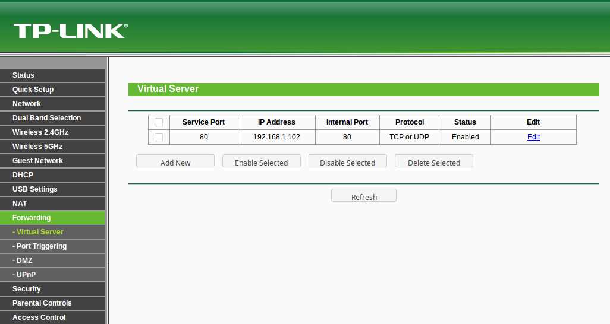

Récemment, j'ai acheté un deuxième Raspberry PI pour transférer une partie de mes sites dessus. L'idée était de partager une partie de sites sur l'un et l'autre.

La Box SFR 4K étant ~~une vraie merde~~ un peu limitée, j'ai investis dans un [routeur TP Link](http://www.tp-link.com/ca/products/details/Archer-C2.html) _(je ne touche pas d’argent pour ce placement de produit :( )_ pour une quarantaine d'euros et j'ai voulu passer ma Box en mode **Bridge**.

L'idée est la suivante:


Au cas ou vous n'avez pas compris, si un utilisateur demande la page:

- [http://rousseau-alexandre.fr](http://rousseau-alexandre.fr), la demande est redirigée vers le **Raspberry PI 2**
- [http://raspberry-cook.fr](http://raspberry-cook.fr), la demande est redirigée vers le **Raspberry PI 3**

## Le branchement

Rien de bien sorcier, on suit la notice:

- Débrancher la Box SFR
- Connecter le Routeur
- Brancher le router sur le port #1 et débrancher tout le reste
- Rallumer la Box SFR et attendre l'initialisation
- Allumer le routeur et attendre l'initialisation

## La partie sur ~~le routeur de merde~~ la boxe SFR

On se connecte à l'interface d'administration de la box via le navigateur en accédant à [http://192.168.0.1](http://192.168.0.1). Ensuite on va sur l'onglet _Réseau > Paramètre de base > Mon réseau local_ et on note l’adresse IP et l’adresse MAC du routeur

```
Router
18:d6:c7:85:7e:a1
192.168.0.17
(1000 Base-T) / 1Gbps
```

Il suffit ensuite de se rendre sur l'onglet _Paramètres avancés > Routeur - Bridge_ et renseigner l'addresse MAC du router et _appliquer les modifications_

## La partie sur les Raspberry PI

Le but ici est de spécifier des adresses IP spécifiques à nos Raspberry PI. L’intérêt est qu'en cas de redémarrage du routeur, les adresses IP des serveurs ne changent pas et les redirections restent correctes.

Ne sortez pas le câble HDMI de votre Raspberry, on fait tout via **SSH**.

On commence par trouver les Raspberry Pi avec un bon vieux **nmap**

```bash
sudo nmap -n -sP 192.168.1.*
```


Il nous suffit donc de se connecter au Raspberry PI via **SSH**:

```bash
ssh pi@192.168.1.101
```

Et on édite le fichier de configuration réseau

```bash
sudo vi /etc/network/interfaces
```

```bash
iface eth0 inet static
    address 192.168.1.102 # le 2 pour se rappeler que c'est le Raspberry PI 2 ;)
    netmash 255.255.255.0
    gateway 192.168.1.1 # l'addresse IP du routeur
```

On fait la même chose pour le Raspberry PI 3 _(et changeant l’adresse IP bien sûr)_.

## La partie sur le routeur TP Link

Vous êtes toujours là? On vient de faire le plus dur! Maintenant on va mettre en place les redirections.

On va donc se connecter au résaux TP Link afin d'accéder à l'interface d'administration (le SSID & le mot de passe sont noté sous l'étiquette dessous). L'interface d'administration est [http://192.168.1.1](http://192.168.1.1) ou bien [http://tplinkWi-fi.net/](http://tplinkWi-fi.net/).

On se rend dans l'onglet _Forwarding > Virtual Server_



A partir de maintenant, le site [rousseau-alexandre.fr](http://rousseau-alexandre.fr) est accessible depuis votre navigateur.

## La partie Apache

Maintenant que notre réseau est prêt, nous allons mettre en place une redirection de proxy Apache à l'aide du module [`mod_proxy_http`](https://httpd.apache.org/docs/2.4/fr/mod/mod_proxy_http.html).

Le principe est simple: tous les paquet passeront par le RPI2 et les redirigera vers le RPI3 en fonction du domaine demandé.

Pour se faire, on active les modules qui vont bien sur le RPI2:

```bash
ssh pi@192.168.1.102
sudo a2enmod proxy_http
```

Sur la RPI2 on ajoute notre configuration Apache

```bash
sudo vi /etc/apache2/site-available/raspberry-cook.fr.conf
```

```apache
<VirtualHost *:80>
    ServerName raspberry-cook.fr
    ServerAdmin contact@rousseau-alexandre.fr

    ProxyPass / http://raspberry-cook.fr/
    ProxyPassReverse / http://192.168.1.103/
    ProxyRequests Off
</VirtualHost>
```

Et on termine par activer le site & redémarrer Apache

```bash
sudo a2ensite raspberry-cook.fr
sudo service apache2 restart
```

Et le tour est joué.
