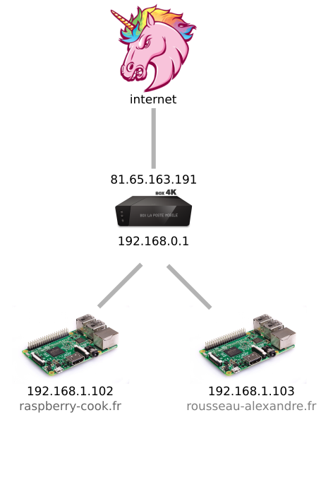
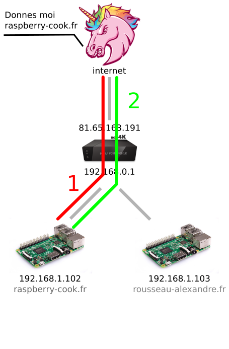
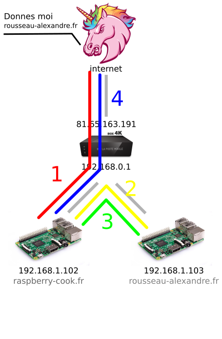

Il arrive un moment ou vous voulez héberger plusieurs site sur plusieurs machines chez vous. Mais la, il y a un problème: vous n'avez qu'une adresse IP publique. A moins que vous payez deux abonnement internet, vous êtes dans le même cas que moi. Et j'ai la solution: [`mod_proxy_http`](https://httpd.apache.org/docs/2.4/fr/mod/mod_proxy_http.html).

## La théorie

Le principe est simple. Vous avez deux serveurs (ou plus) dont un jouera le rôle de routeur.

Admettons le schéma suivant:



Deux cas sont alors possibles




## La pratique!

Pour le serveur de [rousseau-alexandre.fr](http://rousseau-alexandre.fr), aucune configuration spécifique n'est nécessaire. Il s'agit d'une configuration classique. En revanche, pour le deuxième, c'est plus compliqué.

On commence donc par se connecter sur raspberry-cook.fr.

```bash
ssh pi@192.168.1.102
```

On commence par ajouter la corrrespondance du nom de domaines dans le ficher _/etc/hosts_.

```bash
echo '192.168.1.103 rousseau-alexandre.fr' >> /etc/hosts
```

Et on s'attaque à Apache en ajoutant le module nécessaire.

```bash
sudo a2enmod proxy_http
```

Et on ajoute la configuration de nos sites. Pour la configuration de [raspberry-cook.fr](raspberry-cook.fr), il n'y aura rien de particulier, c'est celle de [rousseau-alexandre.fr](http://rousseau-alexandre.fr) qui sera particulière.

```bash
sudo vi /etc/apache2/site-available/rousseau-alexandre.fr.conf
```

```apache
<VirtualHost>
    ServerName rousseau-alexandre.fr
    ServerAdmin contact@rousseau-alexandre.fr
    ProxyPassReverse / http://192.168.1.103/
    ProxyRequests Off
</VirtualHost>
```

Et voilà!
