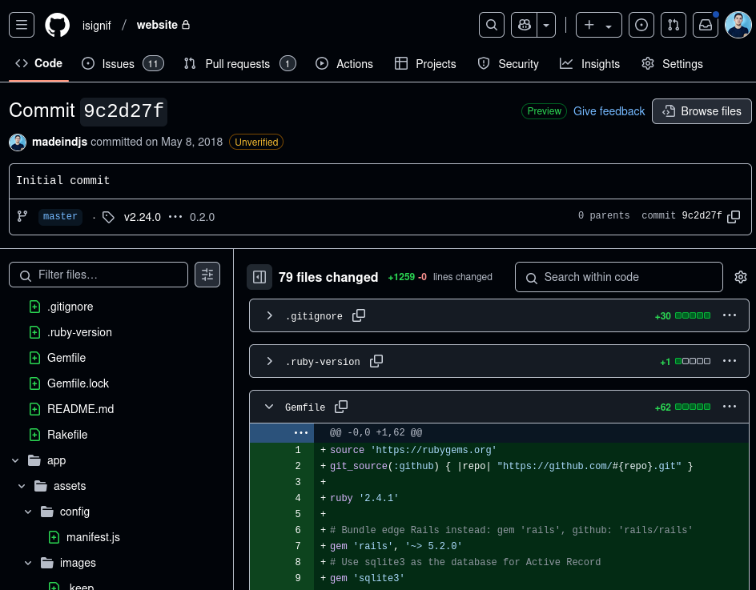
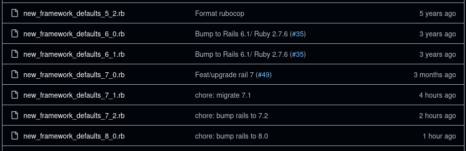
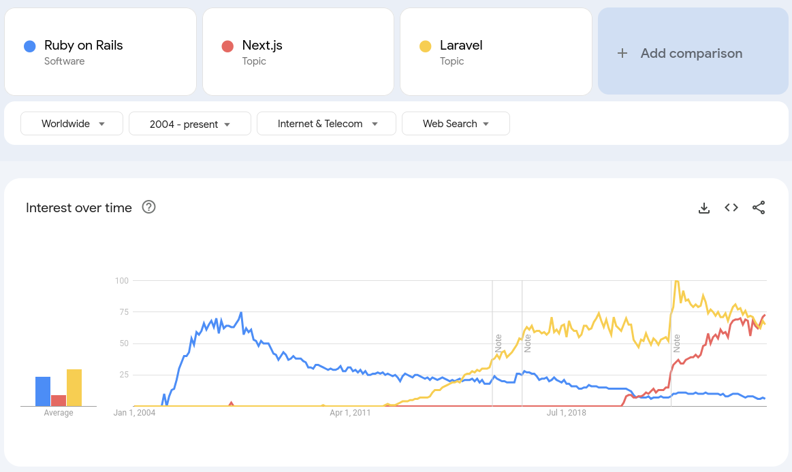
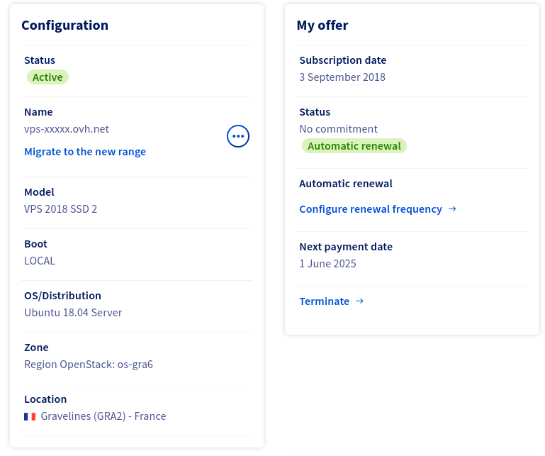

J'ai créé [iSignif](https://isignif.fr), il y a presque 8 ans. Au départ, il s'agissait d'un projet SAAS sympa propulsé par l'une des piles les plus en vogue : [Ruby on Rails](https://rubyonrails.org/).

Presque 8 ans plus tard, je pense que ma _stack_ a rejoint [_the boring Technology Club_](https://boringtechnology.club/), et je suis toujours heureux de maintenir ce projet !

## Le framework

Lorsque j'ai initialisé le projet, j'ai utilisé la dernière version de Ruby on Rails 5.2 / Ruby 2.4.2.

Rails me surprend par la facilité avec laquelle il est possible de passer à des versions majeures. J'ai mis à jour de `v5.x` à `v6.x`, puis `7.x` et enfin `v8.0` avec facilité.

Ma propre expérience a consisté à mettre à jour la version de Rails dans le `Gemfile`, à lancer `rails app:update`, et à exécuter ma suite de tests. `app:update` s'occupe de mettre en place de nouveaux paramètres de configuration par défaut que je m'occupe de vérifier. Toutes les fonctionnalités obsolètes sont souvent annoncées dans la version précédente.

Comparé à mon expérience avec d'autres _stack Front-end_, c'est un jeu d'enfant :

1. Je [me souviens avoir abandonné](/fr/blog/go-back-to-jekyll) la mise à jour de [Gatsby](https://www.gatsbyjs.com/) pour mon site personnel.
2. J'ai eu du mal avec [Nest.js](https://nextjs.org/) et leur nouveau répertoire `app` sur mon application <https://the-killer.online/>

Il est certain que Ruby on Rails n'est pas un choix populaire de nos jours. Je ne vois pas beaucoup d'articles sur les applications Rails sur [Hacker news](https://news.ycombinator.com/), et [cette tendance Google](https://trends.google.com/trends/explore?cat=13&date=all&q=%2Fm%2F0505cl,%2Fg%2F11h4q9rcf3,%2Fm%2F0jwy148&hl=en) de Rails par rapport à d'autres choix populaires confirme la situation...

Je ne vais pas mentir, il est difficile de résister à la _Hype_, et j'ai pensé plusieurs fois à réécrire l'APP en utilisant une nouvelle technologie comme [Nuxt](https://nuxt.com/). Je ne suis toujours pas satisfait de gérer mes templates HTML avec ERB, particulièrement parce que j'utilise professionnellement Vue.js, mais cela fait l'affaire.

**Mais je pense que, lorsqu'un projet nécessite de la stabilité, un framework ennuyeux est un meilleur choix.**

## Le serveur

À l'époque, il suffisait d'avoir un serveur Linux pour héberger son application (la classique [LAMP stack](<https://en.wikipedia.org/wiki/LAMP_(software_bundle)>)). Mais c'est comme cela que j'ai démarré la startup iSignif.

Ensuite, la tendance a été d'utiliser un service PAAS comme [Heroku](https://www.heroku.com/), qui gère tout pour vous. Plus tard, c'est devenu [Docker](https://docker.com/) / Kubernetes et un fournisseur de cloud comme [Google Cloud](https://cloud.google.com/) pour le rendre _scalable_. Et demain, ce sera certainement autre chose.

Pour mon projet, je suis resté sur le même serveur VPS que j'ai commandé il y a 8 ans.

Propulsé par Ubuntu 18.04, il s'agit en fait d'un simple serveur Linux avec [Apache server with Phusion Passenger](/fr/blog/deploy-rails). Là encore, il fait l'affaire. Bien sûr, j'ai dû y mettre du faire certaines choses moi-même:

- mis à jour mon serveur vers Ubuntu 20 puis 22.
- commandé un disque dur supplémentaire et déplacé les fichier de mes utilisateurs dessus
- création de scripts Bash pour la sauvegarde qui tourne avec cron
- [automatisation de quelques scripts de démarrage avec Systemd](/en/blog/sidekiq-on-vps)

Mais c'était vraiment gratifiant de tout faire moi-même, cela m'a beaucoup appris. Mais le plus important, c'est que cela nous a permis de maintenir le coût de l'hébergement très bas. En fait, le serveur me coûte environ 10€/mois. Cela nous a donc permis d'héberger le service même lorsque nous avions peu de revenus.

## Mon sentiment

D'après ma (petite) expérience, j'ai constaté que le lancement d'un SAAS est une longue aventure. Surtout quand on le fait avec un travail à temps plein à côté. Une fonctionnalité que je ferais en une journée complète me prend 2 ou 3 nuits à code de 22h à 1h du matin. Ce n'est donc pas possible de suivre la _hype_ et les nouvelles bonne pratiques. Il faut choisir ses combats et se concentrer sur ce qui compte vraiment.

Cette expérience m'a permis de me forger ma propre opinion sur le rôle du développeur. Je pense maintenant que la chose principale à garder à l'esprit est de penser à l'objectif de la startup, et non à la technologie.

Est-ce que je redémarrerai un projet Ruby on Rails aujourd'hui ? Je ne pense pas. Il existe aujourd'hui d'innombrables technologies plus matures et plus passionnantes. Mais je suis vraiment fier du parcours que j'ai fait avec Ruby. Je pense avoir fait le bon choix il y a 8 ans.
