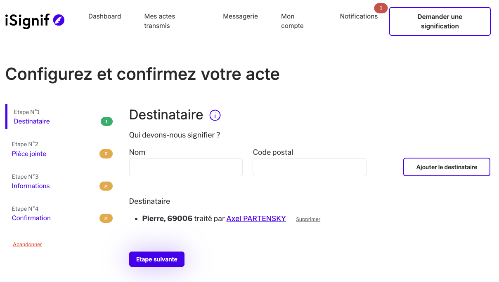
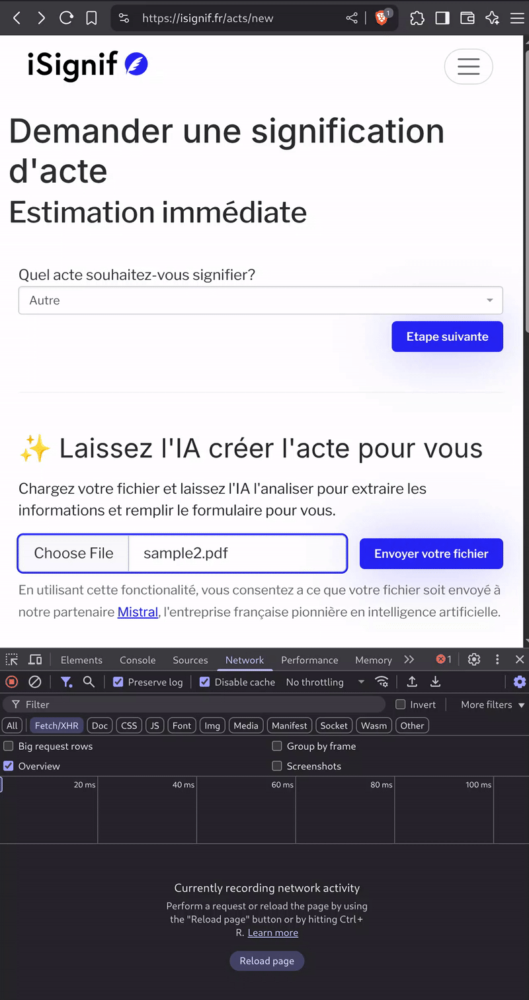

**TL;DR: J'ai utilisé [Mistral][mistral] avec sa fonctionnalité d'OCR et de _structured output_ afin de préremplir un formulaire sur mon SAAS.**

Je viens d'implémenter une fonctionnalité qui s'appuie sur [Mistral][mistral] dans le but d'automatiser un formulaire sur mon SAAS [iSignif][isignif]. Et je vous promets qu'il ne s'agit pas simplement d'un Chatbot ou d'un serveur MCP.

Vous avez entendu parler du protocole MCP qui permet de connecter votre service à un Modèle de Langue (LLM)? Je suppose que oui, et pour dire vrai, j'ai passé beaucoup de temps à essayer de le mettre en place pour mon SAAS [iSignif][isignif].

Ensuite, puis je suis tombé sur cette vidéo : _"Ne vous contentez pas de mettre en place un chatbot : construisez une IA qui fonctionne avant que vous ne le demandiez"_ ([Youtube](https://www.youtube.com/watch?v=2cEGQEllBGc)). Je me suis donc posé la question si l'utilisateur voulait vraiment parler avec un Chatbot au lieu d'utiliser une interface qu'il connait bien.
Et c'est évident que les nouveaux outils d'IA peuvent tellement apporter plus qu'un simple ChatBot.

## Mon produit

J'ai créé [iSignif.fr](https://isignif.fr) il y quelques années pour automatiser le processus de signification entre les avocats et les huissiers de justice. Le processus est le suivant :

1. Un avocat dépose un acte. Il s'agit en fait d'un document PDF qu'un huissier de justice devra remettre en main propre à un ou plusieurs destinataires
2. iSignif sélectionne un huissier de justice en fonction du code postal où l'acte doit être signifié
3. On contacte l'huissier de justice et il prend en charge la demande

La première étape est manuelle : l'avocat doit remplir un formulaire, renseigner les destinataires et charger ses fichiers. Il s'agit de la partie ingrate où l'utilisateur doit recopier les informations sur sa lettre et de renseigner les informations sur le formulaire [iSignif][isignif]. Certains utilisateurs font cela plusieurs fois par jour, et un acte peut regrouper plus d'une dizaine de destinataires...



Peut-être que vous me voyez venir, mais les outils LLM peuvent très bien faire ce travail à la place de l'utilisateur. Donc mon idée était de mettre en place une fonctionnalité qui va simplement préremplir le formulaire à partir du PDF.

En termes techniques, il s'agirait de :

1. Extraire le contenu du document de l'utilisateur. Je vais utiliser une API de _Reconnaissance optique de caractères_ (OCR) afin de convertir le document en text
2. Envoyer le contenu du document à un LLM dans le but de récupérer les informations dans un format donné
3. Créer les ressources demandées en base de données

## Proof of concept

J'ai directement pensé à [Mistral][mistral] qui est un leader français / européen dans l'intelligence artificielle et les modèle de langues (LLM). Je l'ai choisi car

– C'est une entreprise française et cela rassure les utilisateurs sur le traitement de leurs données
– Il possède [une librairie JavaScript][mistralNpm] qui permet de tout faire
– Les prix sont très abordables

Avant de me lancer dans quelque chose de compliqué, je me suis dit que j'allais commencer par mettre en place un simple script qui devra prendre un fichier et faire les appels API à `isignif.fr/api/v1`.

Allez, j'initialise un projet Node.js afin d'essayer ça :

```sh
mkdir /tmp/isignif-pdf
cd /tmp/isignif-pdf
npm init -y
```

Extraire les informations d'un document porte un nom : _Reconnaissance optique de caractères_ (OCR). Il s'agit de l'action de reconnaitre les caractères d'un document, ou d'extraire le texte encodé et de renvoyer le contenu formaté.

[Mistral][mistralOcr] permet de faire ça. Testons vite fait :

```sh
npm install @mistralai/mistralai
npm install --save-dev @types/node
```

```js
// main.mjs
import { Mistral } from "@mistralai/mistralai";
import { openAsBlob } from "node:fs";
import process from "node:process";

// initialize Mistral
const apiKey = process.env.MISTRAL_API_KEY;
if (!apiKey) throw new Error("Missing OpenAI API key");
const mistral = new Mistral({ apiKey });

// open PDF
const blob = await openAsBlob("./sample.pdf");

// upload file to Mistral for OCR and get the URL of the resource
const fileRes = await mistral.files.upload({
  file: blob,
  purpose: "ocr",
});
const fileUrl = await mistral.files.getSignedUrl({ fileId: fileRes.id });

// process the OCR and get the result
const ocrRes = await mistral.ocr.process({
  model: "mistral-ocr-latest",
  document: {
    documentUrl: fileUrl.url,
    type: "document_url",
  },
});
console.log(ocrRes.pages);
```

Cela renvoie un tableau de pages avec le contenu du PDF sous forme de Markdown!

```json
[
  {
    "index": 0,
    "markdown": "# COUR D'APPEL DE DIJON \nLe greffier de la cour d'appel vous avise de la déclaration d'appel dans l'affaire mentionnée ci-dessus dont l'objet est :\n...",
    "images": [],
    "dimensions": { "dpi": 200, "height": 2339, "width": 1654 }
  }
]
```

Maintenant que nous avons le contenu du document, nous devons demander au LLM de nous extraire les informations sous forme de JSON qui contient les données qui nous intéresse. Dans le jargon, cela s'appelle un _Structured Output_.

L'étape clé est de définir ce qu'on veut obtenir sous grâce à un [JSON schema](https://json-schema.org/). Afin de déclarer le JSON schema de manière plus élégante, il est recommandé d'utiliser la libraire [Zod](https://www.npmjs.com/package/zod)

```sh
npm i zod
```

On va déclarer un objet `ResponseFormat` qui contient notre format.

```js
// main.mjs
import { z } from "zod";

// ... code before

const ResponseFormat = z.object({
  significations: z.array(
    z
      .object({
        zipCode: z
          .string()
          .describe(
            "le code postal de la signification (il s'agit souvent de 5 chiffres)",
          ),
        name: z
          .string()
          .describe(
            "le nom de la signification qui permet à l'utilisateur de la retrouver facilement. Il s'agit souvent du lieu qui indique à l'huissier ou signifier l'acte (exemple: 'Carrefour Meyzieu' )",
          ),
      })
      .describe("La signification à signifier"),
  ),
  actType: z.string(),
  reference: z
    .string()
    .optional()
    .describe(
      "Une référence noté sur le document afin d'indentifier la demande et de la retrouver facilement",
    ),
});
```

La partie à ne pas négliger est de bien spécifier les `.describe()`. C'est ce qui va permettre au LLM de comprendre notre schema.

Maintenant, nous pouvons utiliser la méthode `mistral.chat.parse` afin d'extraire les informations et de les transformer en `ResponseFormat`. La encore, essayons de créer une conversation qui permette au LLM d'avoir le maximum de contexte. On crée deux messages :

1. `"system"`, qui va influer sur le comportement de notre LLM
2. `"user"`, qui va formaliser la demande sous forme de texte, et va ensuite contenir le contenu du fichier

```js
// main.mjs

// ... code before
const ocrFileContent = ocrRes.pages.map((p) => p.markdown).join("\n---\n");
const res = await mistral.chat.parse({
  model: "ministral-3b-latest",
  messages: [
    {
      role: "system",
      content: `Tu gère une plateforme du nom de iSignif. Nous simplifions le processus de signification entre les avocats et les huissiers. Le principe est que:
1. une signification est une demande auprès d'un huissier de justice afin qu'il signifie une lettre auprès d'un destinataire. Une signification a seulement besoin d'un code postal afin qu'iSIgnif puisse trouver un huissier de justice compétent dans le département.
2. un acte regroupe plusieurs demandes de significations sous le même type d'acte
Par exemple, l'utilisateur va faire une demande que sont acte "Assignation en justice" soit signifié à Lyon (69), à Marseille (13), et à Toulouse (31). Trois huissiers de justice différents seront contacté. Lorsque les trois huissiers de justice auront remis l'assignation à leur destinataire, l'acte sera marqué comme complet..`,
    },
    {
      role: "user",
      content: `Bonjour, je souhaiterais créer un acte sur iSignif, voici le contenu de mon document qui contient les information de mon acte et des significations (il peut il y en avoir qu'une seule). Peux-tu t'occupper d'extraire les information afin que je puisse créer l'acte moi même ?\n\n\n${ocrFileContent}`,
    },
  ],
  responseFormat: ResponseFormat,
});
const data = ResponseFormat.parse(res.choices?.at(0)?.message?.parsed);
console.log(data);
```

```json
{
  "significations": [
    { "zipCode": "21000", "name": "Dijon" },
    { "zipCode": "21700", "name": "Nuits-Saint-Georges" },
    { "zipCode": "75009", "name": "Paris" }
  ],
  "actType": "Assignation en justice",
  "reference": "25/00258"
}
```

Oura! Je tiens à préciser que je n'ai pas beaucoup d'expérience en ingénierie de _prompt_, mais le résultat est très satisfaisant.

À présent que nous avons les données, il suffit d'exécuter les actions sur [l'API d'iSignif][isignifSwagger]. Je ne vais pas détailler cette partie ici, car elle est sans importance pour le sujet de cet article, mais vous pouvez consulter le code [dans le repository du projet](https://github.com/isignif/pdf-ai/blob/16d5d8bdcdb386a7a91032a990d018aaba7c5cd3/src/ocr.ts#L93-L129).

## Mise en place d'une HTTP API

Tout fonctionne correctement, le _Proof of Concept_ est prometteur, il ne reste plus qu'à le mettre en place sur mon projet en ... [Ruby on Rails](/fr/blog/still-love-rails)!

OK, je viens de faire mon _POC_ en Node.js, Mistral ne propose pas de SDK pour Ruby, et je ne veux pas me compliquer la vie.

A mon sens, il est tout à fait possible de mixer les technologies grâce à des petits micro-services. Dans certains cas, cela peut compliquer l'infrastructure, mais j'ai le sentiment que l'exercice s'y prête plutôt bien ici.

Je pensais à mettre en place une route sur mon API qui prend en paramètre:

- `file`, le fichier de l'utilisateur
- `iSignifApiUrl`, l'URL de l'API à appeler
- `iSignifToken`, le jeton JWT qui permet de s'authentifier à iSignif

J'ai donc factorisé mon _POC_ afin d'avoir une méthode plus générique

```ts
// ocr.ts
// ...
export function useIsignifOCR(
  mistral: Mistral,
  isignifBaseUrl: string,
  token = "",
) {
  const isignifApi = new IsignifApi({
    /*...*/
  });

  const ResponseFormat = z.object({
    /*...*/
  });

  async function computeFile(file: File) {
    // ...
    return { ...data, url: `${isignifHost}/acts/${act.id}` };
  }

  return { computeFile };
}
```

Je me suis dit que j'allais mettre en place un petit serveur avec [Hono](https://hono.dev/).

```ts
import { serve } from "@hono/node-server";
import { zValidator } from "@hono/zod-validator";
import { Mistral } from "@mistralai/mistralai";
import { Hono } from "hono";
import { z } from "zod";
import { useIsignifOCR } from "./ocr.ts";

// setup Mistral
const apiKey = process.env.MISTRAL_API_KEY;
if (!apiKey) throw new Error("Missing OpenAI API key");
const mistral = new Mistral({ apiKey });

const app = new Hono();

app.post(
  "/guess-pdf",
  zValidator(
    "form",
    z.object({
      file: z
        .instanceof(File)
        .refine((file) => file.type === "application/pdf", {
          message: "File must be a PDF",
        }),
      iSignifToken: z.string(),
      iSignifApiUrl: z.string().default("http://isignif.fr/api/v1"),
    }),
  ),
  async (c) => {
    const { file, iSignifApiUrl, iSignifToken } = c.req.valid("form");
    const { computeFile } = useIsignifOCR(mistral, iSignifApiUrl, iSignifToken);
    const res = await computeFile(file);
    return c.redirect(res.url);
  },
);

serve({ fetch: app.fetch, port: 4000 }, (info) => {
  console.log(`Server is running on http://localhost:${info.port}`);
});
```

Le principe est très basique, mais surtout, il peut être connecté à un simple formulaire HTML. La méthode `c.redirect()` permettra de rediriger l'utilisateur sur l'URL de l'acte une fois qu'il a été créé.

```html
<form
  method="POST"
  action="http://localhost:4000/guess-pdf"
  enctype="multipart/form-data"
>
  <input type="file" name="file" accept="application/pdf" required />
  <input type="hidden" name="iSignifToken" value="xxxx" />
  <input
    type="hidden"
    name="iSignifApiUrl"
    value="https://localhost:3000/api/v1"
  />
  <input type="submit" />
</form>
```

...et voici le résultat en production !



## Conclusion

Selon moi, l'IA ne doit pas complètement remplacer notre façon d'interagir avec un service, mais plutôt la faciliter. Cet exemple de fonctionnalité le montre très bien : l'IA ne remplace pas le formulaire, elle aide l'utilisateur à le remplir.

Cela me permet aussi de continuer de proposer l'ancienne expérience à l'utilisateur, et donc de lui laisser le choix. C'est très important dans le cas où l'utilisateur ne veut pas utiliser cette fonctionnalité.

Je suis très content du résultat et je pense le pousser encore plus loin.

Si vous êtes curieux, vous pouvez jeter un coup d'œil au projet : <https://github.com/isignif/pdf-ai>.

[mistral]: https://mistral.ai
[mistralNpm]: https://www.npmjs.com/package/@mistralai/mistralai
[mistralOcr]: https://docs.mistral.ai/capabilities/document/
[mistralJsonOut]: https://docs.mistral.ai/capabilities/structured-output/json_mode/
[isignif]: https://isignif.fr
[isignifSwagger]: https://isignif.fr/docs/openapi
